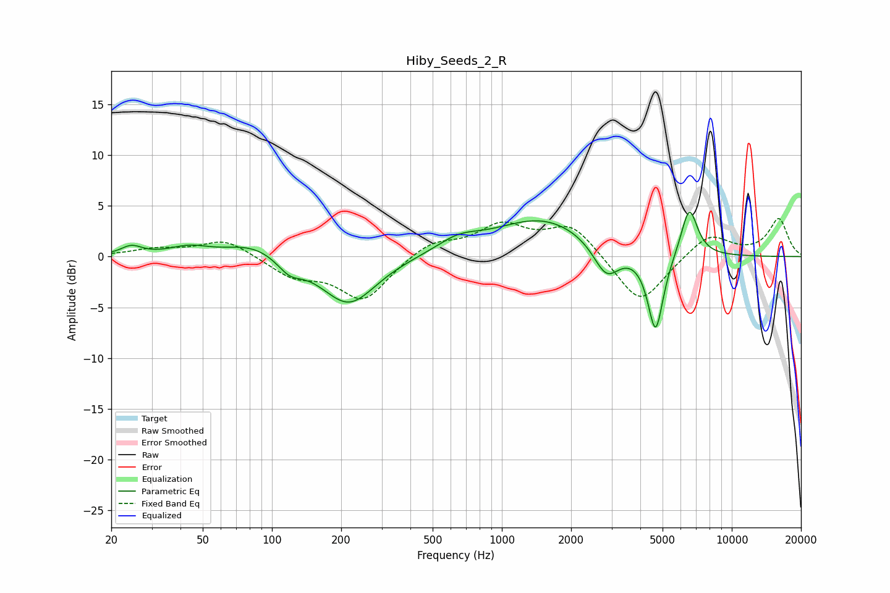

# Hiby_Seeds_2_R
See [usage instructions](https://github.com/jaakkopasanen/AutoEq#usage) for more options and info.

### Parametric EQs
Apply preamp of -4.4 dB when using parametric equalizer.

|   # | Type    |   Fc (Hz) |    Q |   Gain (dB) |
|-----|---------|-----------|------|-------------|
|   1 | Peaking |        24 | 3.18 |         0.9 |
|   2 | Peaking |        44 | 1.68 |         0.8 |
|   3 | Peaking |        84 | 1.13 |         1.4 |
|   4 | Peaking |       119 | 2.66 |        -1.3 |
|   5 | Peaking |       216 | 1.18 |        -4.8 |
|   6 | Peaking |       645 | 1.52 |         1.2 |
|   7 | Peaking |      1504 | 0.66 |         3.7 |
|   8 | Peaking |      2848 | 2.47 |        -3.3 |
|   9 | Peaking |      4662 | 4.06 |        -7.9 |
|  10 | Peaking |      6531 | 3.78 |         4.9 |

### Fixed Band EQs
When using fixed band (also called graphic) equalizer, apply preamp of **-3.8 dB** (if available) and set gains manually with these parameters.

|   # | Type    |   Fc (Hz) |    Q |   Gain (dB) |
|-----|---------|-----------|------|-------------|
|   1 | Peaking |        31 | 1.41 |         0.7 |
|   2 | Peaking |        62 | 1.41 |         1.7 |
|   3 | Peaking |       125 | 1.41 |        -1.8 |
|   4 | Peaking |       250 | 1.41 |        -4.2 |
|   5 | Peaking |       500 | 1.41 |         1.5 |
|   6 | Peaking |      1000 | 1.41 |         2.9 |
|   7 | Peaking |      2000 | 1.41 |         3.1 |
|   8 | Peaking |      4000 | 1.41 |        -4.9 |
|   9 | Peaking |      8000 | 1.41 |         2.3 |
|  10 | Peaking |     16000 | 1.41 |         3.7 |

### Graphs

