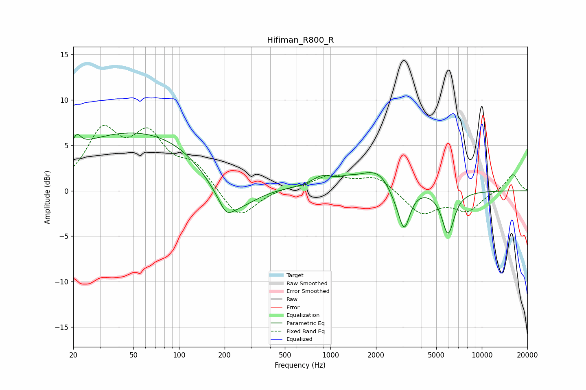

# Hifiman_R800_R
See [usage instructions](https://github.com/jaakkopasanen/AutoEq#usage) for more options and info.

### Parametric EQs
Apply preamp of -6.5 dB when using parametric equalizer.

|   # | Type    |   Fc (Hz) |    Q |   Gain (dB) |
|-----|---------|-----------|------|-------------|
|   1 | Peaking |        21 | 5.52 |         1.3 |
|   2 | Peaking |        64 | 0.23 |         6.9 |
|   3 | Peaking |       205 | 3.21 |        -1.4 |
|   4 | Peaking |       220 | 0.82 |        -5.7 |
|   5 | Peaking |       883 | 2.14 |         1.1 |
|   6 | Peaking |      1289 | 2.57 |         0.4 |
|   7 | Peaking |      2096 | 1.09 |         2.6 |
|   8 | Peaking |      2618 | 2.64 |        -1.1 |
|   9 | Peaking |      3066 | 3.58 |        -4.7 |
|  10 | Peaking |      5980 | 3.4  |        -4.8 |

### Fixed Band EQs
When using fixed band (also called graphic) equalizer, apply preamp of **-7.3 dB** (if available) and set gains manually with these parameters.

|   # | Type    |   Fc (Hz) |    Q |   Gain (dB) |
|-----|---------|-----------|------|-------------|
|   1 | Peaking |        31 | 1.41 |         6.1 |
|   2 | Peaking |        62 | 1.41 |         5.4 |
|   3 | Peaking |       125 | 1.41 |         2.6 |
|   4 | Peaking |       250 | 1.41 |        -3.3 |
|   5 | Peaking |       500 | 1.41 |         0.3 |
|   6 | Peaking |      1000 | 1.41 |         1.6 |
|   7 | Peaking |      2000 | 1.41 |         1.6 |
|   8 | Peaking |      4000 | 1.41 |        -2.5 |
|   9 | Peaking |      8000 | 1.41 |        -2.1 |
|  10 | Peaking |     16000 | 1.41 |         1.9 |

### Graphs

