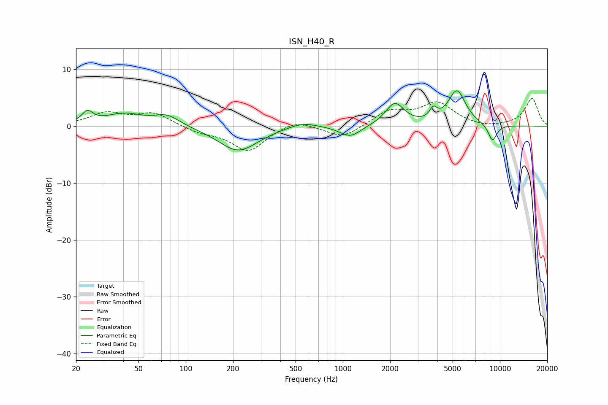

# ISN_H40_R
See [usage instructions](https://github.com/jaakkopasanen/AutoEq#usage) for more options and info.

### Parametric EQs
Apply preamp of -6.3 dB when using parametric equalizer.

|   # | Type    |   Fc (Hz) |    Q |   Gain (dB) |
|-----|---------|-----------|------|-------------|
|   1 | Peaking |        24 | 4.1  |         2   |
|   2 | Peaking |        40 | 1.17 |         2.1 |
|   3 | Peaking |        76 | 1.75 |         1.8 |
|   4 | Peaking |       216 | 1.13 |        -4.4 |
|   5 | Peaking |       552 | 1.55 |         1   |
|   6 | Peaking |      1115 | 2.12 |        -2   |
|   7 | Peaking |      2143 | 2.4  |         4   |
|   8 | Peaking |      3770 | 6    |         1.8 |
|   9 | Peaking |      5323 | 2.49 |         6.1 |
|  10 | Peaking |      8970 | 4.51 |        -3   |

### Fixed Band EQs
When using fixed band (also called graphic) equalizer, apply preamp of **-5.0 dB** (if available) and set gains manually with these parameters.

|   # | Type    |   Fc (Hz) |    Q |   Gain (dB) |
|-----|---------|-----------|------|-------------|
|   1 | Peaking |        31 | 1.41 |         2.2 |
|   2 | Peaking |        62 | 1.41 |         2.2 |
|   3 | Peaking |       125 | 1.41 |        -1   |
|   4 | Peaking |       250 | 1.41 |        -4.4 |
|   5 | Peaking |       500 | 1.41 |         1.3 |
|   6 | Peaking |      1000 | 1.41 |        -2.2 |
|   7 | Peaking |      2000 | 1.41 |         2.6 |
|   8 | Peaking |      4000 | 1.41 |         3.9 |
|   9 | Peaking |      8000 | 1.41 |        -0.4 |
|  10 | Peaking |     16000 | 1.41 |         4.9 |

### Graphs

