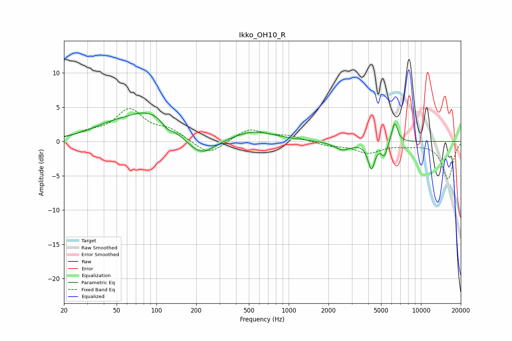

# Ikko_OH10_R
See [usage instructions](https://github.com/jaakkopasanen/AutoEq#usage) for more options and info.

### Parametric EQs
Apply preamp of -4.3 dB when using parametric equalizer.

|   # | Type    |   Fc (Hz) |    Q |   Gain (dB) |
|-----|---------|-----------|------|-------------|
|   1 | Peaking |        43 | 0.9  |         1.2 |
|   2 | Peaking |        89 | 0.75 |         4.2 |
|   3 | Peaking |       121 | 3.56 |        -0.9 |
|   4 | Peaking |       211 | 1.11 |        -2.7 |
|   5 | Peaking |       223 | 2.29 |        -0.4 |
|   6 | Peaking |       534 | 0.86 |         1.6 |
|   7 | Peaking |      2559 | 2.25 |        -1.2 |
|   8 | Peaking |      4218 | 5.47 |        -3.8 |
|   9 | Peaking |      5278 | 6    |        -2   |
|  10 | Peaking |      6331 | 6    |         3   |

### Fixed Band EQs
When using fixed band (also called graphic) equalizer, apply preamp of **-4.9 dB** (if available) and set gains manually with these parameters.

|   # | Type    |   Fc (Hz) |    Q |   Gain (dB) |
|-----|---------|-----------|------|-------------|
|   1 | Peaking |        31 | 1.41 |         1   |
|   2 | Peaking |        62 | 1.41 |         4.4 |
|   3 | Peaking |       125 | 1.41 |         1.5 |
|   4 | Peaking |       250 | 1.41 |        -2.1 |
|   5 | Peaking |       500 | 1.41 |         1.8 |
|   6 | Peaking |      1000 | 1.41 |         0.8 |
|   7 | Peaking |      2000 | 1.41 |        -0.5 |
|   8 | Peaking |      4000 | 1.41 |        -1.6 |
|   9 | Peaking |      8000 | 1.41 |        -0.4 |
|  10 | Peaking |     16000 | 1.41 |        -5.5 |

### Graphs

