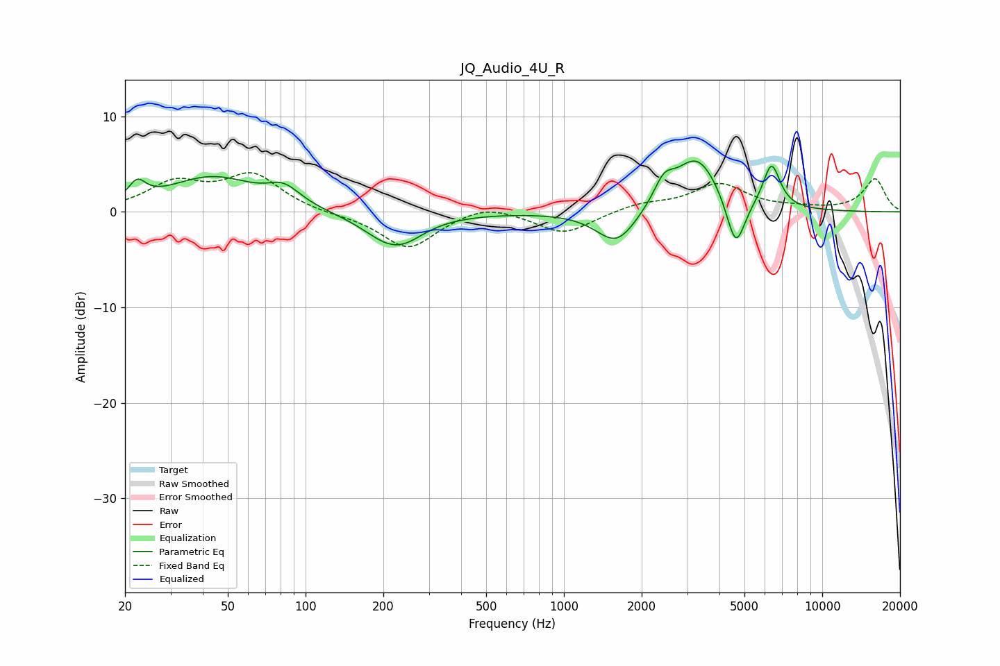

# JQ_Audio_4U_R
See [usage instructions](https://github.com/jaakkopasanen/AutoEq#usage) for more options and info.

### Parametric EQs
Apply preamp of -5.4 dB when using parametric equalizer.

|   # | Type    |   Fc (Hz) |    Q |   Gain (dB) |
|-----|---------|-----------|------|-------------|
|   1 | Peaking |        22 | 4.36 |         1.9 |
|   2 | Peaking |        43 | 0.82 |         3.6 |
|   3 | Peaking |        83 | 2.28 |         1.8 |
|   4 | Peaking |       216 | 1.32 |        -3.4 |
|   5 | Peaking |       250 | 2.18 |        -0.5 |
|   6 | Peaking |      1602 | 1.78 |        -3.7 |
|   7 | Peaking |      2436 | 3.69 |         2.2 |
|   8 | Peaking |      3273 | 1.56 |         5.9 |
|   9 | Peaking |      4625 | 3.8  |        -5.6 |
|  10 | Peaking |      6363 | 4.11 |         4.6 |

### Fixed Band EQs
When using fixed band (also called graphic) equalizer, apply preamp of **-4.2 dB** (if available) and set gains manually with these parameters.

|   # | Type    |   Fc (Hz) |    Q |   Gain (dB) |
|-----|---------|-----------|------|-------------|
|   1 | Peaking |        31 | 1.41 |         2.8 |
|   2 | Peaking |        62 | 1.41 |         3.7 |
|   3 | Peaking |       125 | 1.41 |        -0.2 |
|   4 | Peaking |       250 | 1.41 |        -3.9 |
|   5 | Peaking |       500 | 1.41 |         1   |
|   6 | Peaking |      1000 | 1.41 |        -2.3 |
|   7 | Peaking |      2000 | 1.41 |         0.8 |
|   8 | Peaking |      4000 | 1.41 |         2.8 |
|   9 | Peaking |      8000 | 1.41 |         0.3 |
|  10 | Peaking |     16000 | 1.41 |         3.4 |

### Graphs

