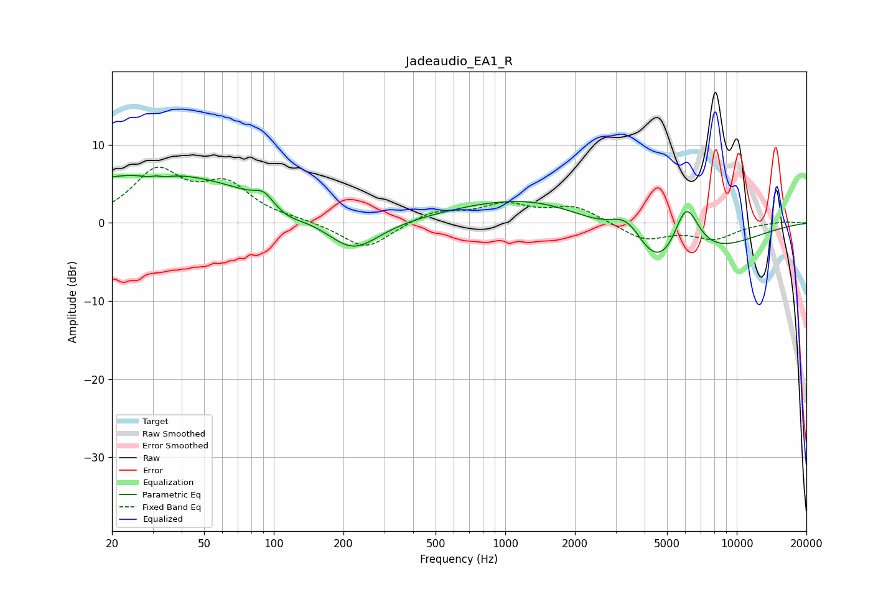

# Jadeaudio_EA1_R
See [usage instructions](https://github.com/jaakkopasanen/AutoEq#usage) for more options and info.

### Parametric EQs
Apply preamp of -6.2 dB when using parametric equalizer.

|   # | Type    |   Fc (Hz) |    Q |   Gain (dB) |
|-----|---------|-----------|------|-------------|
|   1 | Peaking |        31 | 0.32 |         6.5 |
|   2 | Peaking |        31 | 3.54 |        -2   |
|   3 | Peaking |        31 | 4.66 |         1.6 |
|   4 | Peaking |        91 | 3.6  |         1.4 |
|   5 | Peaking |       114 | 1.93 |        -1.3 |
|   6 | Peaking |       219 | 1.22 |        -4.4 |
|   7 | Peaking |      1544 | 0.41 |         4.4 |
|   8 | Peaking |      3383 | 1.72 |         4.8 |
|   9 | Peaking |      4756 | 0.67 |       -11.4 |
|  10 | Peaking |      6031 | 2.12 |         9.2 |

### Fixed Band EQs
When using fixed band (also called graphic) equalizer, apply preamp of **-7.2 dB** (if available) and set gains manually with these parameters.

|   # | Type    |   Fc (Hz) |    Q |   Gain (dB) |
|-----|---------|-----------|------|-------------|
|   1 | Peaking |        31 | 1.41 |         6.3 |
|   2 | Peaking |        62 | 1.41 |         4.4 |
|   3 | Peaking |       125 | 1.41 |         0.3 |
|   4 | Peaking |       250 | 1.41 |        -3.5 |
|   5 | Peaking |       500 | 1.41 |         1.5 |
|   6 | Peaking |      1000 | 1.41 |         2.2 |
|   7 | Peaking |      2000 | 1.41 |         2   |
|   8 | Peaking |      4000 | 1.41 |        -2.2 |
|   9 | Peaking |      8000 | 1.41 |        -1.9 |
|  10 | Peaking |     16000 | 1.41 |         0.2 |

### Graphs

