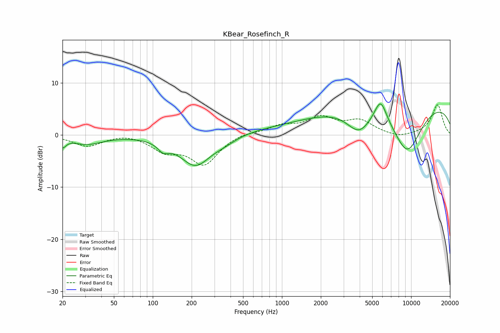

# KBear_Rosefinch_R
See [usage instructions](https://github.com/jaakkopasanen/AutoEq#usage) for more options and info.

### Parametric EQs
Apply preamp of -6.1 dB when using parametric equalizer.

|   # | Type    |   Fc (Hz) |    Q |   Gain (dB) |
|-----|---------|-----------|------|-------------|
|   1 | Peaking |        20 | 5.55 |        -1.7 |
|   2 | Peaking |        31 | 1.17 |        -1.7 |
|   3 | Peaking |       120 | 3.41 |        -1.6 |
|   4 | Peaking |       214 | 1.17 |        -5.9 |
|   5 | Peaking |       361 | 1.54 |        -0.9 |
|   6 | Peaking |      1811 | 0.19 |         1.2 |
|   7 | Peaking |      3944 | 1.44 |        -4.7 |
|   8 | Peaking |      5800 | 2.91 |         4.5 |
|   9 | Peaking |      9312 | 1.01 |       -10.1 |
|  10 | Peaking |      9631 | 0.18 |         7   |

### Fixed Band EQs
When using fixed band (also called graphic) equalizer, apply preamp of **-5.9 dB** (if available) and set gains manually with these parameters.

|   # | Type    |   Fc (Hz) |    Q |   Gain (dB) |
|-----|---------|-----------|------|-------------|
|   1 | Peaking |        31 | 1.41 |        -2.1 |
|   2 | Peaking |        62 | 1.41 |         0.5 |
|   3 | Peaking |       125 | 1.41 |        -2.7 |
|   4 | Peaking |       250 | 1.41 |        -5.4 |
|   5 | Peaking |       500 | 1.41 |         0.6 |
|   6 | Peaking |      1000 | 1.41 |         1.6 |
|   7 | Peaking |      2000 | 1.41 |         3.1 |
|   8 | Peaking |      4000 | 1.41 |         2.5 |
|   9 | Peaking |      8000 | 1.41 |        -0.7 |
|  10 | Peaking |     16000 | 1.41 |         5.8 |

### Graphs

