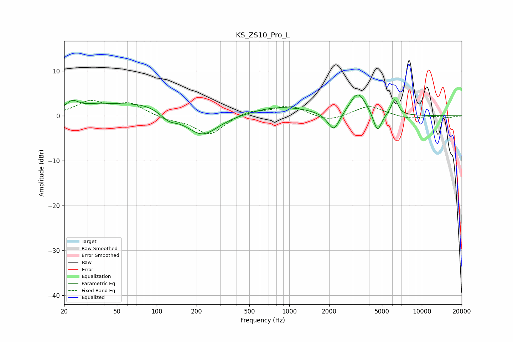

# KS_ZS10_Pro_L
See [usage instructions](https://github.com/jaakkopasanen/AutoEq#usage) for more options and info.

### Parametric EQs
Apply preamp of -4.8 dB when using parametric equalizer.

|   # | Type    |   Fc (Hz) |    Q |   Gain (dB) |
|-----|---------|-----------|------|-------------|
|   1 | Peaking |        23 | 2.72 |         2.2 |
|   2 | Peaking |        35 | 1.23 |         1.2 |
|   3 | Peaking |        80 | 0.57 |         2.9 |
|   4 | Peaking |       123 | 2.2  |        -2   |
|   5 | Peaking |       219 | 1.14 |        -5.2 |
|   6 | Peaking |       854 | 0.64 |         2.1 |
|   7 | Peaking |      2166 | 3.1  |        -4.3 |
|   8 | Peaking |      3295 | 2.29 |         5.2 |
|   9 | Peaking |      4628 | 4.49 |        -4.5 |
|  10 | Peaking |      6248 | 5.36 |         3.6 |

### Fixed Band EQs
When using fixed band (also called graphic) equalizer, apply preamp of **-3.5 dB** (if available) and set gains manually with these parameters.

|   # | Type    |   Fc (Hz) |    Q |   Gain (dB) |
|-----|---------|-----------|------|-------------|
|   1 | Peaking |        31 | 1.41 |         3   |
|   2 | Peaking |        62 | 1.41 |         2.6 |
|   3 | Peaking |       125 | 1.41 |        -0.8 |
|   4 | Peaking |       250 | 1.41 |        -4.2 |
|   5 | Peaking |       500 | 1.41 |         1.2 |
|   6 | Peaking |      1000 | 1.41 |         2.3 |
|   7 | Peaking |      2000 | 1.41 |        -1.3 |
|   8 | Peaking |      4000 | 1.41 |         2.3 |
|   9 | Peaking |      8000 | 1.41 |        -0.7 |
|  10 | Peaking |     16000 | 1.41 |        -0.4 |

### Graphs

