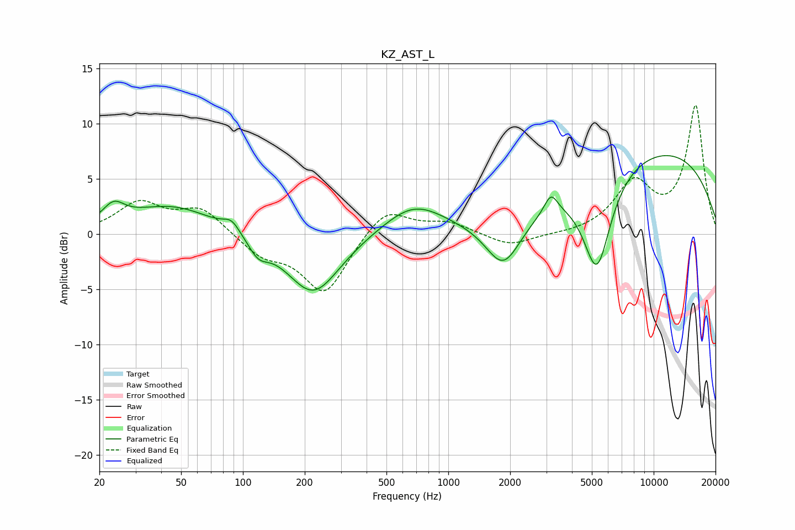

# KZ_AST_L
See [usage instructions](https://github.com/jaakkopasanen/AutoEq#usage) for more options and info.

### Parametric EQs
Apply preamp of -7.2 dB when using parametric equalizer.

|   # | Type    |   Fc (Hz) |    Q |   Gain (dB) |
|-----|---------|-----------|------|-------------|
|   1 | Peaking |        23 | 2.75 |         1.6 |
|   2 | Peaking |        45 | 0.66 |         2.6 |
|   3 | Peaking |        88 | 3.52 |         1   |
|   4 | Peaking |       119 | 2.91 |        -1.4 |
|   5 | Peaking |       220 | 1.08 |        -5.6 |
|   6 | Peaking |       678 | 0.94 |         2.8 |
|   7 | Peaking |      1855 | 1.64 |        -4.5 |
|   8 | Peaking |      3161 | 4.32 |         1.8 |
|   9 | Peaking |      5290 | 2.01 |        -8.8 |
|  10 | Peaking |     10000 | 0.27 |         7.7 |

### Fixed Band EQs
When using fixed band (also called graphic) equalizer, apply preamp of **-11.8 dB** (if available) and set gains manually with these parameters.

|   # | Type    |   Fc (Hz) |    Q |   Gain (dB) |
|-----|---------|-----------|------|-------------|
|   1 | Peaking |        31 | 1.41 |         2.7 |
|   2 | Peaking |        62 | 1.41 |         2.3 |
|   3 | Peaking |       125 | 1.41 |        -1.8 |
|   4 | Peaking |       250 | 1.41 |        -5.4 |
|   5 | Peaking |       500 | 1.41 |         2.5 |
|   6 | Peaking |      1000 | 1.41 |         1   |
|   7 | Peaking |      2000 | 1.41 |        -1.1 |
|   8 | Peaking |      4000 | 1.41 |        -0.1 |
|   9 | Peaking |      8000 | 1.41 |         4.4 |
|  10 | Peaking |     16000 | 1.41 |        11.5 |

### Graphs

