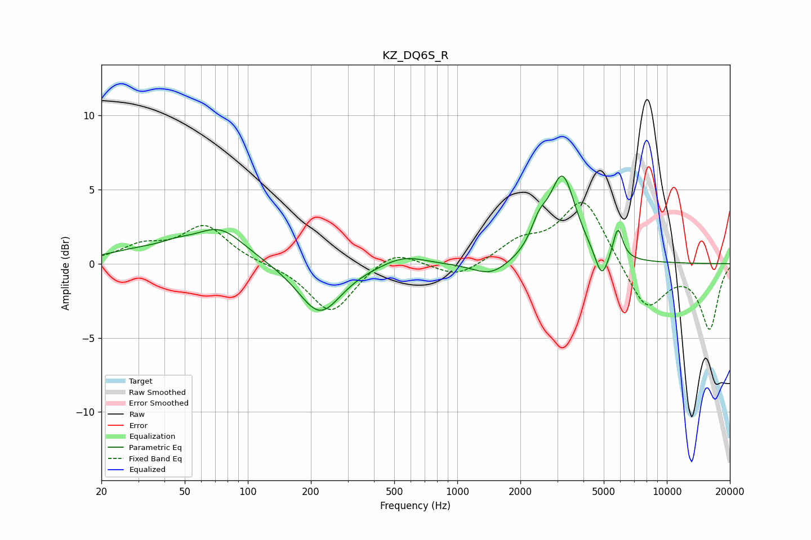

# KZ_DQ6S_R
See [usage instructions](https://github.com/jaakkopasanen/AutoEq#usage) for more options and info.

### Parametric EQs
Apply preamp of -6.0 dB when using parametric equalizer.

|   # | Type    |   Fc (Hz) |    Q |   Gain (dB) |
|-----|---------|-----------|------|-------------|
|   1 | Peaking |        30 | 0.9  |         0.7 |
|   2 | Peaking |        46 | 1.79 |         0.5 |
|   3 | Peaking |        74 | 1.17 |         2.2 |
|   4 | Peaking |       221 | 1.38 |        -3.4 |
|   5 | Peaking |       555 | 1.41 |         0.7 |
|   6 | Peaking |      1449 | 1.62 |        -1   |
|   7 | Peaking |      2453 | 3.65 |         1.5 |
|   8 | Peaking |      3176 | 2.23 |         5.8 |
|   9 | Peaking |      4891 | 4.46 |        -1.9 |
|  10 | Peaking |      5838 | 6    |         2.2 |

### Fixed Band EQs
When using fixed band (also called graphic) equalizer, apply preamp of **-4.2 dB** (if available) and set gains manually with these parameters.

|   # | Type    |   Fc (Hz) |    Q |   Gain (dB) |
|-----|---------|-----------|------|-------------|
|   1 | Peaking |        31 | 1.41 |         1.1 |
|   2 | Peaking |        62 | 1.41 |         2.5 |
|   3 | Peaking |       125 | 1.41 |        -0   |
|   4 | Peaking |       250 | 1.41 |        -3.4 |
|   5 | Peaking |       500 | 1.41 |         1.1 |
|   6 | Peaking |      1000 | 1.41 |        -1   |
|   7 | Peaking |      2000 | 1.41 |         1.3 |
|   8 | Peaking |      4000 | 1.41 |         4.4 |
|   9 | Peaking |      8000 | 1.41 |        -3.2 |
|  10 | Peaking |     16000 | 1.41 |        -4.3 |

### Graphs

