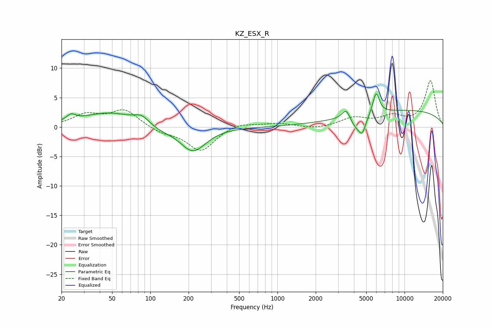

# KZ_ESX_R
See [usage instructions](https://github.com/jaakkopasanen/AutoEq#usage) for more options and info.

### Parametric EQs
Apply preamp of -5.7 dB when using parametric equalizer.

|   # | Type    |   Fc (Hz) |    Q |   Gain (dB) |
|-----|---------|-----------|------|-------------|
|   1 | Peaking |        24 | 4.12 |         1   |
|   2 | Peaking |        47 | 0.64 |         2.4 |
|   3 | Peaking |        86 | 2.56 |         1.2 |
|   4 | Peaking |       120 | 1.59 |        -0.6 |
|   5 | Peaking |       216 | 1.39 |        -4.2 |
|   6 | Peaking |      3483 | 4.29 |         2   |
|   7 | Peaking |      4094 | 2.87 |        -1.9 |
|   8 | Peaking |      4654 | 4.88 |        -2.6 |
|   9 | Peaking |      5974 | 5.35 |         3.6 |
|  10 | Peaking |     10000 | 0.25 |         2.8 |

### Fixed Band EQs
When using fixed band (also called graphic) equalizer, apply preamp of **-7.9 dB** (if available) and set gains manually with these parameters.

|   # | Type    |   Fc (Hz) |    Q |   Gain (dB) |
|-----|---------|-----------|------|-------------|
|   1 | Peaking |        31 | 1.41 |         2   |
|   2 | Peaking |        62 | 1.41 |         2.8 |
|   3 | Peaking |       125 | 1.41 |        -0.9 |
|   4 | Peaking |       250 | 1.41 |        -4.1 |
|   5 | Peaking |       500 | 1.41 |         0.8 |
|   6 | Peaking |      1000 | 1.41 |         0.6 |
|   7 | Peaking |      2000 | 1.41 |        -0.4 |
|   8 | Peaking |      4000 | 1.41 |         1.5 |
|   9 | Peaking |      8000 | 1.41 |         1.6 |
|  10 | Peaking |     16000 | 1.41 |         7.8 |

### Graphs

