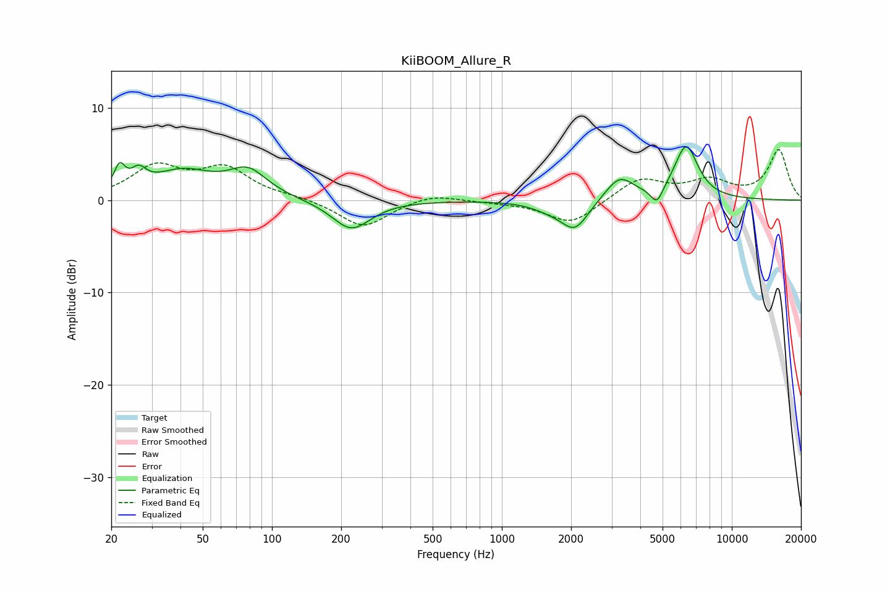

# KiiBOOM_Allure_R
See [usage instructions](https://github.com/jaakkopasanen/AutoEq#usage) for more options and info.

### Parametric EQs
Apply preamp of -5.9 dB when using parametric equalizer.

|   # | Type    |   Fc (Hz) |    Q |   Gain (dB) |
|-----|---------|-----------|------|-------------|
|   1 | Peaking |        22 | 5.93 |         2.5 |
|   2 | Peaking |        26 | 4.35 |         1.7 |
|   3 | Peaking |        41 | 1.06 |         2.9 |
|   4 | Peaking |        79 | 1.71 |         2.8 |
|   5 | Peaking |       221 | 1.68 |        -3.2 |
|   6 | Peaking |      1614 | 1.86 |        -0.7 |
|   7 | Peaking |      2079 | 2.37 |        -3.1 |
|   8 | Peaking |      3250 | 2.27 |         2.6 |
|   9 | Peaking |      4724 | 5.32 |        -1.8 |
|  10 | Peaking |      6332 | 2.65 |         5.8 |

### Fixed Band EQs
When using fixed band (also called graphic) equalizer, apply preamp of **-5.6 dB** (if available) and set gains manually with these parameters.

|   # | Type    |   Fc (Hz) |    Q |   Gain (dB) |
|-----|---------|-----------|------|-------------|
|   1 | Peaking |        31 | 1.41 |         3.4 |
|   2 | Peaking |        62 | 1.41 |         3.2 |
|   3 | Peaking |       125 | 1.41 |         0.3 |
|   4 | Peaking |       250 | 1.41 |        -3   |
|   5 | Peaking |       500 | 1.41 |         0.8 |
|   6 | Peaking |      1000 | 1.41 |        -0.2 |
|   7 | Peaking |      2000 | 1.41 |        -2.6 |
|   8 | Peaking |      4000 | 1.41 |         2.3 |
|   9 | Peaking |      8000 | 1.41 |         1.9 |
|  10 | Peaking |     16000 | 1.41 |         5.4 |

### Graphs

