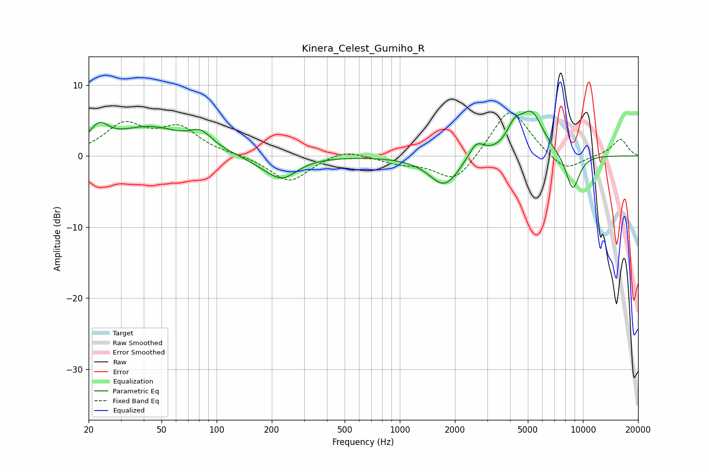

# Kinera_Celest_Gumiho_R
See [usage instructions](https://github.com/jaakkopasanen/AutoEq#usage) for more options and info.

### Parametric EQs
Apply preamp of -6.4 dB when using parametric equalizer.

|   # | Type    |   Fc (Hz) |    Q |   Gain (dB) |
|-----|---------|-----------|------|-------------|
|   1 | Peaking |        23 | 2.77 |         2.8 |
|   2 | Peaking |        43 | 0.75 |         3.8 |
|   3 | Peaking |        82 | 2.37 |         2   |
|   4 | Peaking |       174 | 1.54 |        -0.7 |
|   5 | Peaking |       228 | 1.71 |        -3   |
|   6 | Peaking |      1751 | 1.71 |        -4.3 |
|   7 | Peaking |      2616 | 3.25 |         2.3 |
|   8 | Peaking |      4222 | 3.39 |         2.6 |
|   9 | Peaking |      5244 | 2.08 |         5.9 |
|  10 | Peaking |      8789 | 3.37 |        -5.2 |

### Fixed Band EQs
When using fixed band (also called graphic) equalizer, apply preamp of **-6.2 dB** (if available) and set gains manually with these parameters.

|   # | Type    |   Fc (Hz) |    Q |   Gain (dB) |
|-----|---------|-----------|------|-------------|
|   1 | Peaking |        31 | 1.41 |         4.2 |
|   2 | Peaking |        62 | 1.41 |         3.7 |
|   3 | Peaking |       125 | 1.41 |         0.2 |
|   4 | Peaking |       250 | 1.41 |        -3.7 |
|   5 | Peaking |       500 | 1.41 |         1.1 |
|   6 | Peaking |      1000 | 1.41 |        -0.9 |
|   7 | Peaking |      2000 | 1.41 |        -3.9 |
|   8 | Peaking |      4000 | 1.41 |         7.1 |
|   9 | Peaking |      8000 | 1.41 |        -2.5 |
|  10 | Peaking |     16000 | 1.41 |         2.4 |

### Graphs

