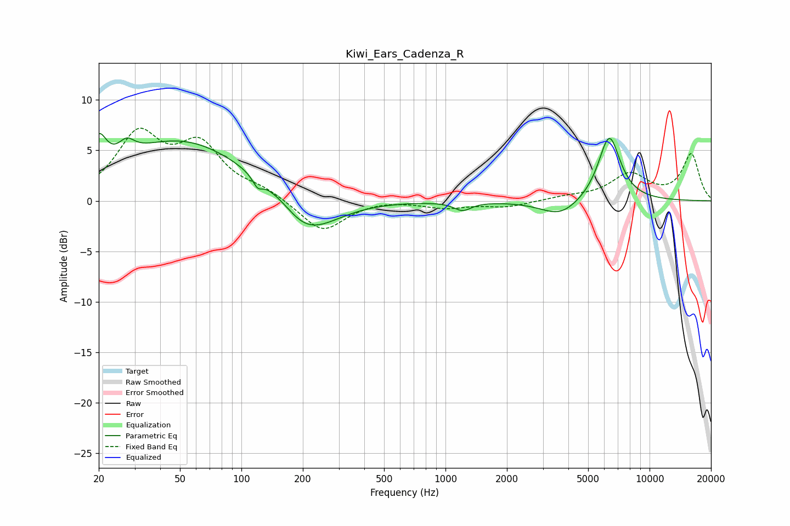

# Kiwi_Ears_Cadenza_R
See [usage instructions](https://github.com/jaakkopasanen/AutoEq#usage) for more options and info.

### Parametric EQs
Apply preamp of -6.8 dB when using parametric equalizer.

|   # | Type    |   Fc (Hz) |    Q |   Gain (dB) |
|-----|---------|-----------|------|-------------|
|   1 | Peaking |        20 | 3.93 |         3.3 |
|   2 | Peaking |        27 | 3.8  |         1.3 |
|   3 | Peaking |        50 | 0.44 |         6   |
|   4 | Peaking |       120 | 5.99 |        -1   |
|   5 | Peaking |       187 | 1.87 |        -0.4 |
|   6 | Peaking |       204 | 1.56 |        -1.2 |
|   7 | Peaking |       237 | 0.98 |        -2.5 |
|   8 | Peaking |      1213 | 3.4  |        -0.8 |
|   9 | Peaking |      3651 | 1.48 |        -1.6 |
|  10 | Peaking |      6347 | 2.52 |         6.5 |

### Fixed Band EQs
When using fixed band (also called graphic) equalizer, apply preamp of **-7.3 dB** (if available) and set gains manually with these parameters.

|   # | Type    |   Fc (Hz) |    Q |   Gain (dB) |
|-----|---------|-----------|------|-------------|
|   1 | Peaking |        31 | 1.41 |         6.2 |
|   2 | Peaking |        62 | 1.41 |         5   |
|   3 | Peaking |       125 | 1.41 |         0.9 |
|   4 | Peaking |       250 | 1.41 |        -3.1 |
|   5 | Peaking |       500 | 1.41 |         0.2 |
|   6 | Peaking |      1000 | 1.41 |        -0.6 |
|   7 | Peaking |      2000 | 1.41 |        -0.6 |
|   8 | Peaking |      4000 | 1.41 |         0.3 |
|   9 | Peaking |      8000 | 1.41 |         2.6 |
|  10 | Peaking |     16000 | 1.41 |         4.6 |

### Graphs

