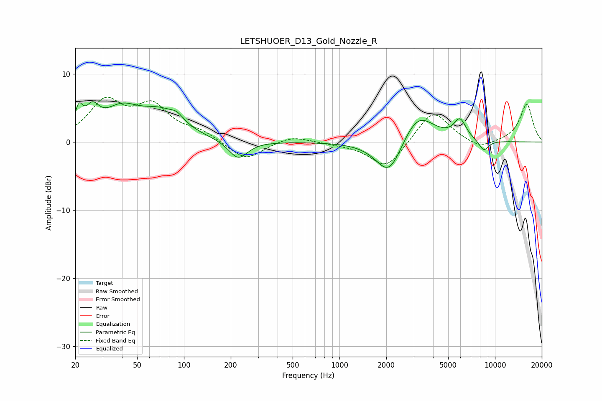

# LETSHUOER_D13_Gold_Nozzle_R
See [usage instructions](https://github.com/jaakkopasanen/AutoEq#usage) for more options and info.

### Parametric EQs
Apply preamp of -6.0 dB when using parametric equalizer.

|   # | Type    |   Fc (Hz) |    Q |   Gain (dB) |
|-----|---------|-----------|------|-------------|
|   1 | Peaking |        21 | 5.72 |         3.2 |
|   2 | Peaking |        26 | 3.3  |         3.1 |
|   3 | Peaking |        39 | 1.24 |         3.9 |
|   4 | Peaking |        71 | 1.03 |         3.7 |
|   5 | Peaking |        90 | 3.47 |         0.9 |
|   6 | Peaking |       223 | 2.34 |        -2.7 |
|   7 | Peaking |      2089 | 1.64 |        -5.6 |
|   8 | Peaking |      3177 | 1.34 |         4.7 |
|   9 | Peaking |      5953 | 3.48 |         2.8 |
|  10 | Peaking |      8468 | 3.96 |        -1.6 |

### Fixed Band EQs
When using fixed band (also called graphic) equalizer, apply preamp of **-6.7 dB** (if available) and set gains manually with these parameters.

|   # | Type    |   Fc (Hz) |    Q |   Gain (dB) |
|-----|---------|-----------|------|-------------|
|   1 | Peaking |        31 | 1.41 |         5.6 |
|   2 | Peaking |        62 | 1.41 |         4.8 |
|   3 | Peaking |       125 | 1.41 |         1.3 |
|   4 | Peaking |       250 | 1.41 |        -2.7 |
|   5 | Peaking |       500 | 1.41 |         1   |
|   6 | Peaking |      1000 | 1.41 |        -0.2 |
|   7 | Peaking |      2000 | 1.41 |        -4   |
|   8 | Peaking |      4000 | 1.41 |         4.8 |
|   9 | Peaking |      8000 | 1.41 |        -1.2 |
|  10 | Peaking |     16000 | 1.41 |         5.6 |

### Graphs

