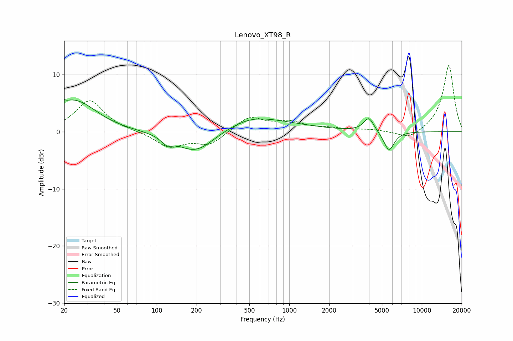

# Lenovo_XT98_R
See [usage instructions](https://github.com/jaakkopasanen/AutoEq#usage) for more options and info.

### Parametric EQs
Apply preamp of -5.7 dB when using parametric equalizer.

|   # | Type    |   Fc (Hz) |    Q |   Gain (dB) |
|-----|---------|-----------|------|-------------|
|   1 | Peaking |        20 | 5.65 |         3.4 |
|   2 | Peaking |        20 | 5.95 |        -2.9 |
|   3 | Peaking |        22 | 0.83 |         4.3 |
|   4 | Peaking |        28 | 1.06 |         1.3 |
|   5 | Peaking |       119 | 3.37 |        -1.3 |
|   6 | Peaking |       198 | 0.99 |        -4   |
|   7 | Peaking |       517 | 1.14 |         0.7 |
|   8 | Peaking |       581 | 0.46 |         2.1 |
|   9 | Peaking |      3982 | 3.68 |         2.5 |
|  10 | Peaking |      5651 | 3.51 |        -3.5 |

### Fixed Band EQs
When using fixed band (also called graphic) equalizer, apply preamp of **-11.7 dB** (if available) and set gains manually with these parameters.

|   # | Type    |   Fc (Hz) |    Q |   Gain (dB) |
|-----|---------|-----------|------|-------------|
|   1 | Peaking |        31 | 1.41 |         5.5 |
|   2 | Peaking |        62 | 1.41 |         0   |
|   3 | Peaking |       125 | 1.41 |        -2.6 |
|   4 | Peaking |       250 | 1.41 |        -2.2 |
|   5 | Peaking |       500 | 1.41 |         2.6 |
|   6 | Peaking |      1000 | 1.41 |         1.5 |
|   7 | Peaking |      2000 | 1.41 |         0.5 |
|   8 | Peaking |      4000 | 1.41 |         0.3 |
|   9 | Peaking |      8000 | 1.41 |        -1.4 |
|  10 | Peaking |     16000 | 1.41 |        11.7 |

### Graphs

