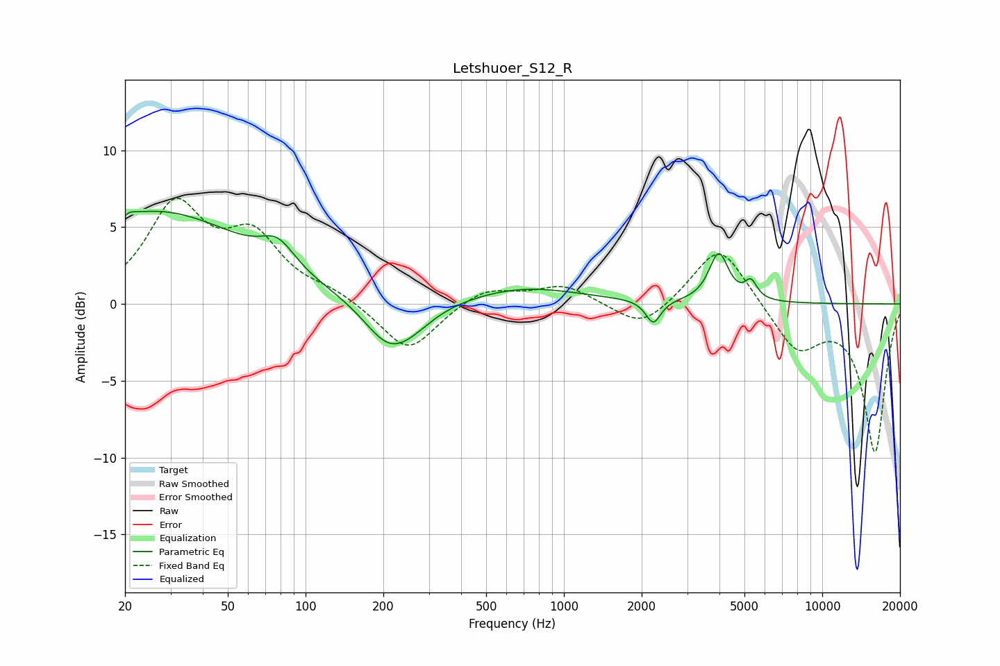

# Letshuoer_S12_R
See [usage instructions](https://github.com/jaakkopasanen/AutoEq#usage) for more options and info.

### Parametric EQs
Apply preamp of -6.1 dB when using parametric equalizer.

|   # | Type    |   Fc (Hz) |    Q |   Gain (dB) |
|-----|---------|-----------|------|-------------|
|   1 | Peaking |        20 | 5.93 |        -3.3 |
|   2 | Peaking |        20 | 5.9  |         3.3 |
|   3 | Peaking |        26 | 0.39 |         6   |
|   4 | Peaking |        78 | 2.18 |         1.6 |
|   5 | Peaking |       208 | 1.47 |        -2.6 |
|   6 | Peaking |       255 | 1.48 |        -1   |
|   7 | Peaking |       703 | 0.65 |         1.1 |
|   8 | Peaking |      2218 | 4.94 |        -1.5 |
|   9 | Peaking |      3975 | 3.79 |         3.2 |
|  10 | Peaking |      5296 | 5.99 |         1.1 |

### Fixed Band EQs
When using fixed band (also called graphic) equalizer, apply preamp of **-7.0 dB** (if available) and set gains manually with these parameters.

|   # | Type    |   Fc (Hz) |    Q |   Gain (dB) |
|-----|---------|-----------|------|-------------|
|   1 | Peaking |        31 | 1.41 |         6.1 |
|   2 | Peaking |        62 | 1.41 |         3.9 |
|   3 | Peaking |       125 | 1.41 |         0.7 |
|   4 | Peaking |       250 | 1.41 |        -3.2 |
|   5 | Peaking |       500 | 1.41 |         1.1 |
|   6 | Peaking |      1000 | 1.41 |         1.2 |
|   7 | Peaking |      2000 | 1.41 |        -1.7 |
|   8 | Peaking |      4000 | 1.41 |         4   |
|   9 | Peaking |      8000 | 1.41 |        -3   |
|  10 | Peaking |     16000 | 1.41 |        -9.6 |

### Graphs

