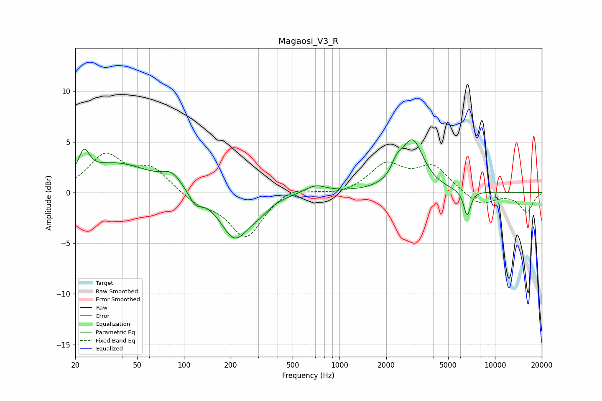

# Magaosi_V3_R
See [usage instructions](https://github.com/jaakkopasanen/AutoEq#usage) for more options and info.

### Parametric EQs
Apply preamp of -5.3 dB when using parametric equalizer.

|   # | Type    |   Fc (Hz) |    Q |   Gain (dB) |
|-----|---------|-----------|------|-------------|
|   1 | Peaking |        23 | 4.2  |         2.3 |
|   2 | Peaking |        37 | 0.65 |         2.8 |
|   3 | Peaking |        84 | 2.18 |         1.3 |
|   4 | Peaking |       118 | 3.42 |        -1.2 |
|   5 | Peaking |       212 | 1.51 |        -4.5 |
|   6 | Peaking |       304 | 2.12 |        -0.8 |
|   7 | Peaking |       702 | 2.02 |         0.8 |
|   8 | Peaking |      2339 | 4.27 |         1.2 |
|   9 | Peaking |      2949 | 1.99 |         5   |
|  10 | Peaking |      6625 | 6    |        -2.5 |

### Fixed Band EQs
When using fixed band (also called graphic) equalizer, apply preamp of **-4.0 dB** (if available) and set gains manually with these parameters.

|   # | Type    |   Fc (Hz) |    Q |   Gain (dB) |
|-----|---------|-----------|------|-------------|
|   1 | Peaking |        31 | 1.41 |         3.5 |
|   2 | Peaking |        62 | 1.41 |         2.2 |
|   3 | Peaking |       125 | 1.41 |        -1   |
|   4 | Peaking |       250 | 1.41 |        -4.4 |
|   5 | Peaking |       500 | 1.41 |         0.8 |
|   6 | Peaking |      1000 | 1.41 |        -0.3 |
|   7 | Peaking |      2000 | 1.41 |         2.7 |
|   8 | Peaking |      4000 | 1.41 |         2.5 |
|   9 | Peaking |      8000 | 1.41 |        -1.3 |
|  10 | Peaking |     16000 | 1.41 |        -1.9 |

### Graphs

