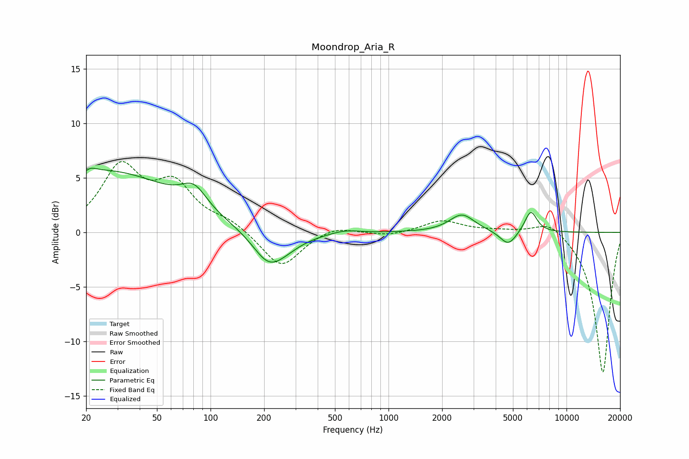

# Moondrop_Aria_R
See [usage instructions](https://github.com/jaakkopasanen/AutoEq#usage) for more options and info.

### Parametric EQs
Apply preamp of -6.0 dB when using parametric equalizer.

|   # | Type    |   Fc (Hz) |    Q |   Gain (dB) |
|-----|---------|-----------|------|-------------|
|   1 | Peaking |        20 | 5.99 |        -3   |
|   2 | Peaking |        20 | 5.17 |         3.3 |
|   3 | Peaking |        26 | 0.37 |         5.6 |
|   4 | Peaking |        81 | 1.99 |         2   |
|   5 | Peaking |       211 | 1.57 |        -2.7 |
|   6 | Peaking |       260 | 1.3  |        -0.9 |
|   7 | Peaking |       568 | 1.82 |         0.3 |
|   8 | Peaking |      2587 | 2.01 |         1.6 |
|   9 | Peaking |      4708 | 3.03 |        -1.4 |
|  10 | Peaking |      6302 | 4    |         2   |

### Fixed Band EQs
When using fixed band (also called graphic) equalizer, apply preamp of **-6.6 dB** (if available) and set gains manually with these parameters.

|   # | Type    |   Fc (Hz) |    Q |   Gain (dB) |
|-----|---------|-----------|------|-------------|
|   1 | Peaking |        31 | 1.41 |         5.7 |
|   2 | Peaking |        62 | 1.41 |         4   |
|   3 | Peaking |       125 | 1.41 |         0.9 |
|   4 | Peaking |       250 | 1.41 |        -3.3 |
|   5 | Peaking |       500 | 1.41 |         0.7 |
|   6 | Peaking |      1000 | 1.41 |        -0.3 |
|   7 | Peaking |      2000 | 1.41 |         1.1 |
|   8 | Peaking |      4000 | 1.41 |         0.2 |
|   9 | Peaking |      8000 | 1.41 |         1.3 |
|  10 | Peaking |     16000 | 1.41 |       -13   |

### Graphs

