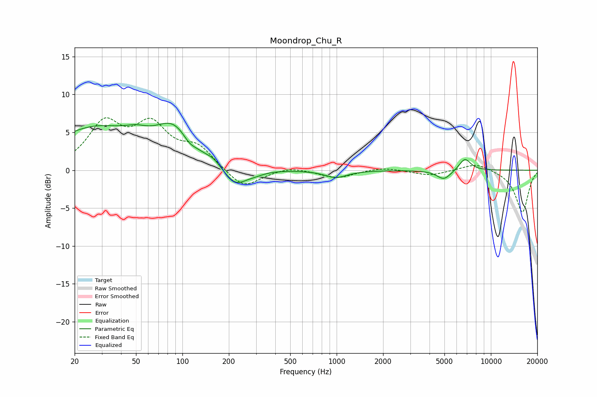

# Moondrop_Chu_R
See [usage instructions](https://github.com/jaakkopasanen/AutoEq#usage) for more options and info.

### Parametric EQs
Apply preamp of -6.3 dB when using parametric equalizer.

|   # | Type    |   Fc (Hz) |    Q |   Gain (dB) |
|-----|---------|-----------|------|-------------|
|   1 | Peaking |        27 | 0.5  |         5.4 |
|   2 | Peaking |        50 | 1.96 |         0.9 |
|   3 | Peaking |        88 | 1.19 |         4.5 |
|   4 | Peaking |       111 | 3.45 |        -0.8 |
|   5 | Peaking |       159 | 3.1  |         0.6 |
|   6 | Peaking |       220 | 1.87 |        -2.5 |
|   7 | Peaking |       296 | 2.32 |        -0.4 |
|   8 | Peaking |       991 | 1.95 |        -1   |
|   9 | Peaking |      4966 | 3    |        -1.3 |
|  10 | Peaking |      6786 | 3.6  |         1.6 |

### Fixed Band EQs
When using fixed band (also called graphic) equalizer, apply preamp of **-7.0 dB** (if available) and set gains manually with these parameters.

|   # | Type    |   Fc (Hz) |    Q |   Gain (dB) |
|-----|---------|-----------|------|-------------|
|   1 | Peaking |        31 | 1.41 |         5.8 |
|   2 | Peaking |        62 | 1.41 |         5.3 |
|   3 | Peaking |       125 | 1.41 |         2.7 |
|   4 | Peaking |       250 | 1.41 |        -2.6 |
|   5 | Peaking |       500 | 1.41 |         0.5 |
|   6 | Peaking |      1000 | 1.41 |        -1   |
|   7 | Peaking |      2000 | 1.41 |         0.4 |
|   8 | Peaking |      4000 | 1.41 |        -0.7 |
|   9 | Peaking |      8000 | 1.41 |         1   |
|  10 | Peaking |     16000 | 1.41 |        -5.6 |

### Graphs

