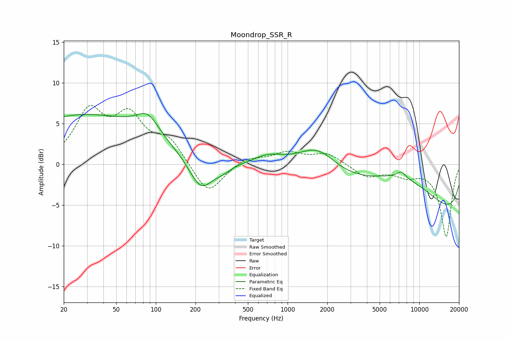

# Moondrop_SSR_R
See [usage instructions](https://github.com/jaakkopasanen/AutoEq#usage) for more options and info.

### Parametric EQs
Apply preamp of -6.3 dB when using parametric equalizer.

|   # | Type    |   Fc (Hz) |    Q |   Gain (dB) |
|-----|---------|-----------|------|-------------|
|   1 | Peaking |        20 | 1.3  |         0.2 |
|   2 | Peaking |        30 | 0.27 |         5.9 |
|   3 | Peaking |        87 | 1.68 |         2.4 |
|   4 | Peaking |       220 | 1.55 |        -3.9 |
|   5 | Peaking |       323 | 1.94 |        -0.7 |
|   6 | Peaking |       725 | 1.2  |         1.1 |
|   7 | Peaking |      1686 | 0.98 |         3.2 |
|   8 | Peaking |      7285 | 0.4  |         5.9 |
|   9 | Peaking |      7294 | 3.95 |         0.8 |
|  10 | Peaking |     10000 | 0.18 |        -8.1 |

### Fixed Band EQs
When using fixed band (also called graphic) equalizer, apply preamp of **-7.3 dB** (if available) and set gains manually with these parameters.

|   # | Type    |   Fc (Hz) |    Q |   Gain (dB) |
|-----|---------|-----------|------|-------------|
|   1 | Peaking |        31 | 1.41 |         6.1 |
|   2 | Peaking |        62 | 1.41 |         5.3 |
|   3 | Peaking |       125 | 1.41 |         2.8 |
|   4 | Peaking |       250 | 1.41 |        -3.9 |
|   5 | Peaking |       500 | 1.41 |         0.9 |
|   6 | Peaking |      1000 | 1.41 |         1.4 |
|   7 | Peaking |      2000 | 1.41 |         1.3 |
|   8 | Peaking |      4000 | 1.41 |        -1.5 |
|   9 | Peaking |      8000 | 1.41 |        -1.2 |
|  10 | Peaking |     16000 | 1.41 |        -8.8 |

### Graphs

