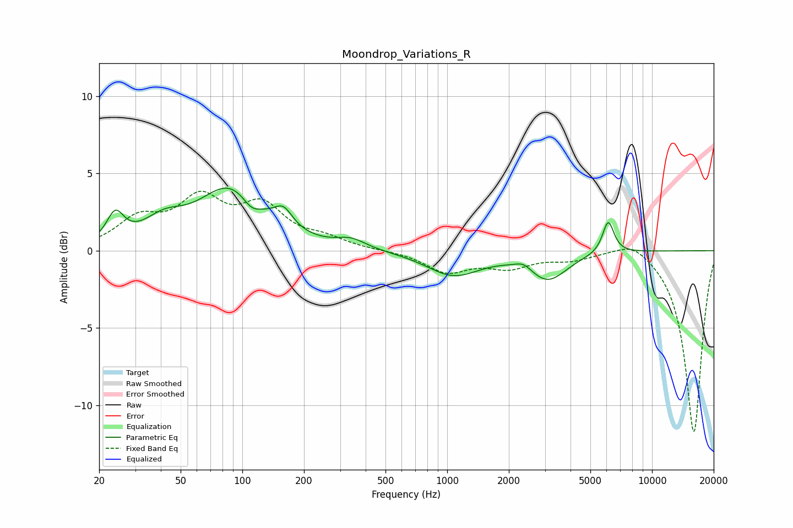

# Moondrop_Variations_R
See [usage instructions](https://github.com/jaakkopasanen/AutoEq#usage) for more options and info.

### Parametric EQs
Apply preamp of -4.1 dB when using parametric equalizer.

|   # | Type    |   Fc (Hz) |    Q |   Gain (dB) |
|-----|---------|-----------|------|-------------|
|   1 | Peaking |        24 | 3.44 |         1.9 |
|   2 | Peaking |        41 | 1.43 |         1.4 |
|   3 | Peaking |        88 | 0.91 |         4   |
|   4 | Peaking |       111 | 3.11 |        -0.8 |
|   5 | Peaking |       159 | 3.11 |         1.2 |
|   6 | Peaking |       340 | 1.98 |         0.6 |
|   7 | Peaking |      1071 | 1.09 |        -1.6 |
|   8 | Peaking |      2362 | 3.74 |         0.4 |
|   9 | Peaking |      3104 | 1.53 |        -1.8 |
|  10 | Peaking |      6114 | 4.92 |         2.1 |

### Fixed Band EQs
When using fixed band (also called graphic) equalizer, apply preamp of **-3.9 dB** (if available) and set gains manually with these parameters.

|   # | Type    |   Fc (Hz) |    Q |   Gain (dB) |
|-----|---------|-----------|------|-------------|
|   1 | Peaking |        31 | 1.41 |         1.8 |
|   2 | Peaking |        62 | 1.41 |         3   |
|   3 | Peaking |       125 | 1.41 |         2.6 |
|   4 | Peaking |       250 | 1.41 |         0.6 |
|   5 | Peaking |       500 | 1.41 |         0   |
|   6 | Peaking |      1000 | 1.41 |        -1.3 |
|   7 | Peaking |      2000 | 1.41 |        -1   |
|   8 | Peaking |      4000 | 1.41 |        -0.5 |
|   9 | Peaking |      8000 | 1.41 |         0.9 |
|  10 | Peaking |     16000 | 1.41 |       -11.8 |

### Graphs

