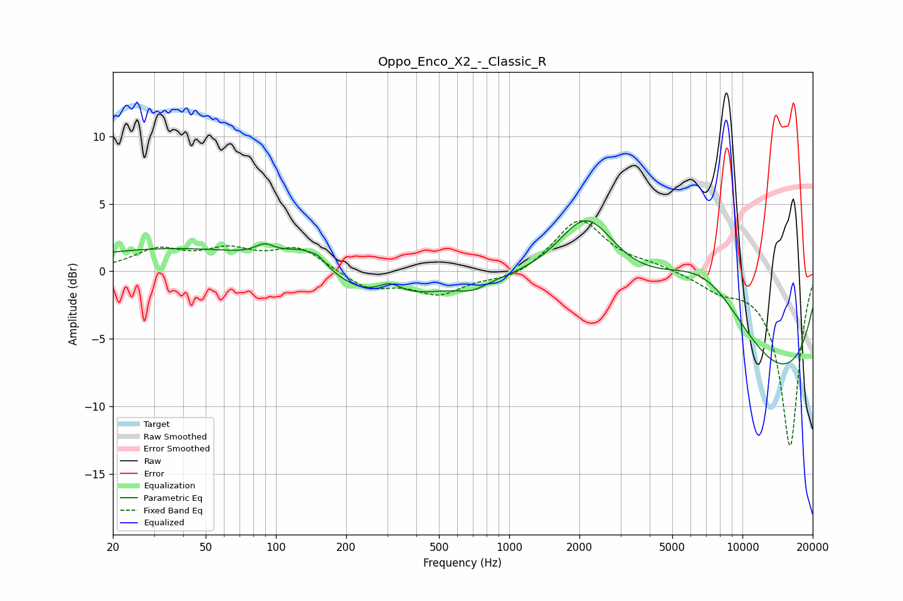

# Oppo_Enco_X2_-_Classic_R
See [usage instructions](https://github.com/jaakkopasanen/AutoEq#usage) for more options and info.

### Parametric EQs
Apply preamp of -3.8 dB when using parametric equalizer.

|   # | Type    |   Fc (Hz) |    Q |   Gain (dB) |
|-----|---------|-----------|------|-------------|
|   1 | Peaking |        50 | 0.26 |         1.9 |
|   2 | Peaking |        90 | 3.47 |         0.7 |
|   3 | Peaking |       136 | 1.39 |         2   |
|   4 | Peaking |       153 | 5.92 |         0.3 |
|   5 | Peaking |       240 | 0.47 |        -2.8 |
|   6 | Peaking |       307 | 2.79 |         0.9 |
|   7 | Peaking |       697 | 2.21 |        -0.6 |
|   8 | Peaking |      2146 | 1.14 |         5.2 |
|   9 | Peaking |      6977 | 0.48 |        10.7 |
|  10 | Peaking |      9995 | 0.25 |       -12.6 |

### Fixed Band EQs
When using fixed band (also called graphic) equalizer, apply preamp of **-3.8 dB** (if available) and set gains manually with these parameters.

|   # | Type    |   Fc (Hz) |    Q |   Gain (dB) |
|-----|---------|-----------|------|-------------|
|   1 | Peaking |        31 | 1.41 |         1.5 |
|   2 | Peaking |        62 | 1.41 |         1.4 |
|   3 | Peaking |       125 | 1.41 |         1.7 |
|   4 | Peaking |       250 | 1.41 |        -1.3 |
|   5 | Peaking |       500 | 1.41 |        -1.6 |
|   6 | Peaking |      1000 | 1.41 |        -0.7 |
|   7 | Peaking |      2000 | 1.41 |         3.9 |
|   8 | Peaking |      4000 | 1.41 |         0.4 |
|   9 | Peaking |      8000 | 1.41 |        -1.1 |
|  10 | Peaking |     16000 | 1.41 |       -13   |

### Graphs

