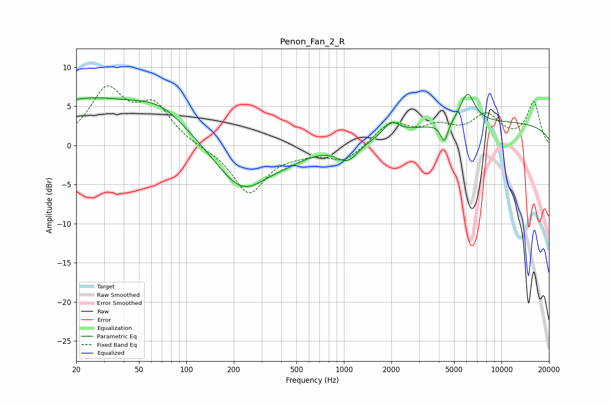

# Penon_Fan_2_R
See [usage instructions](https://github.com/jaakkopasanen/AutoEq#usage) for more options and info.

### Parametric EQs
Apply preamp of -6.6 dB when using parametric equalizer.

|   # | Type    |   Fc (Hz) |    Q |   Gain (dB) |
|-----|---------|-----------|------|-------------|
|   1 | Peaking |        22 | 0.41 |         5.5 |
|   2 | Peaking |        70 | 0.77 |         3.4 |
|   3 | Peaking |       227 | 0.85 |        -5.9 |
|   4 | Peaking |       448 | 1.23 |        -0.7 |
|   5 | Peaking |      1055 | 2.1  |        -2.2 |
|   6 | Peaking |      1997 | 3.05 |         1.7 |
|   7 | Peaking |      4332 | 5.8  |        -2.5 |
|   8 | Peaking |      5747 | 2.8  |         0.1 |
|   9 | Peaking |      6084 | 3.05 |         3.8 |
|  10 | Peaking |      8951 | 0.18 |         2.9 |

### Fixed Band EQs
When using fixed band (also called graphic) equalizer, apply preamp of **-7.7 dB** (if available) and set gains manually with these parameters.

|   # | Type    |   Fc (Hz) |    Q |   Gain (dB) |
|-----|---------|-----------|------|-------------|
|   1 | Peaking |        31 | 1.41 |         6.8 |
|   2 | Peaking |        62 | 1.41 |         4.7 |
|   3 | Peaking |       125 | 1.41 |        -0.2 |
|   4 | Peaking |       250 | 1.41 |        -6.1 |
|   5 | Peaking |       500 | 1.41 |        -0.6 |
|   6 | Peaking |      1000 | 1.41 |        -2   |
|   7 | Peaking |      2000 | 1.41 |         2.8 |
|   8 | Peaking |      4000 | 1.41 |         2   |
|   9 | Peaking |      8000 | 1.41 |         3.5 |
|  10 | Peaking |     16000 | 1.41 |         5.4 |

### Graphs

