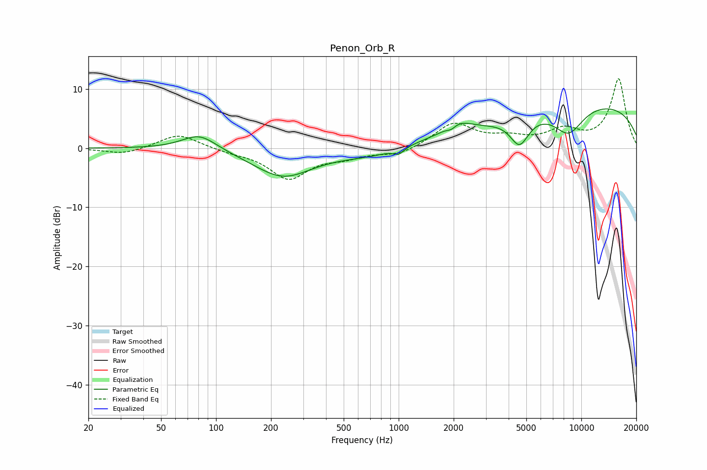

# Penon_Orb_R
See [usage instructions](https://github.com/jaakkopasanen/AutoEq#usage) for more options and info.

### Parametric EQs
Apply preamp of -6.7 dB when using parametric equalizer.

|   # | Type    |   Fc (Hz) |    Q |   Gain (dB) |
|-----|---------|-----------|------|-------------|
|   1 | Peaking |        81 | 1.48 |         2.8 |
|   2 | Peaking |       233 | 0.87 |        -4.8 |
|   3 | Peaking |       690 | 0.83 |        -1.2 |
|   4 | Peaking |      1000 | 5.03 |        -1   |
|   5 | Peaking |      1946 | 5.69 |        -0.7 |
|   6 | Peaking |      2104 | 2.01 |         1.7 |
|   7 | Peaking |      3160 | 1.29 |        -0.5 |
|   8 | Peaking |      4586 | 2.66 |        -4.9 |
|   9 | Peaking |      8509 | 1.54 |        -4.9 |
|  10 | Peaking |      9862 | 0.21 |         7.8 |

### Fixed Band EQs
When using fixed band (also called graphic) equalizer, apply preamp of **-11.8 dB** (if available) and set gains manually with these parameters.

|   # | Type    |   Fc (Hz) |    Q |   Gain (dB) |
|-----|---------|-----------|------|-------------|
|   1 | Peaking |        31 | 1.41 |        -1.1 |
|   2 | Peaking |        62 | 1.41 |         2.5 |
|   3 | Peaking |       125 | 1.41 |        -0.5 |
|   4 | Peaking |       250 | 1.41 |        -5   |
|   5 | Peaking |       500 | 1.41 |        -1.2 |
|   6 | Peaking |      1000 | 1.41 |        -1.2 |
|   7 | Peaking |      2000 | 1.41 |         4.2 |
|   8 | Peaking |      4000 | 1.41 |         1.4 |
|   9 | Peaking |      8000 | 1.41 |         2.7 |
|  10 | Peaking |     16000 | 1.41 |        11.7 |

### Graphs

