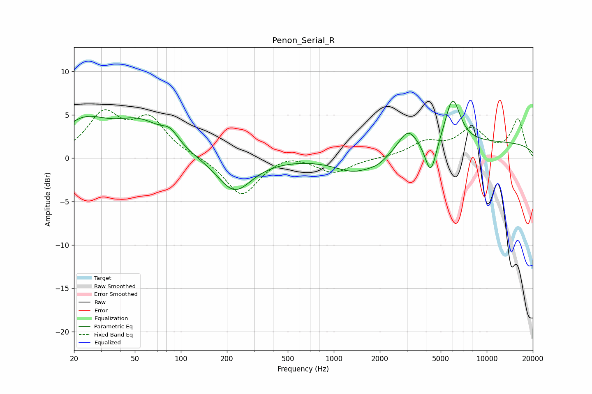

# Penon_Serial_R
See [usage instructions](https://github.com/jaakkopasanen/AutoEq#usage) for more options and info.

### Parametric EQs
Apply preamp of -6.7 dB when using parametric equalizer.

|   # | Type    |   Fc (Hz) |    Q |   Gain (dB) |
|-----|---------|-----------|------|-------------|
|   1 | Peaking |        23 | 0.9  |         3.8 |
|   2 | Peaking |        54 | 0.85 |         3.6 |
|   3 | Peaking |        85 | 2.61 |         1.4 |
|   4 | Peaking |       224 | 1.25 |        -4   |
|   5 | Peaking |      1357 | 1.12 |        -1.8 |
|   6 | Peaking |      1949 | 1.89 |        -0.8 |
|   7 | Peaking |      3052 | 2.34 |         2.4 |
|   8 | Peaking |      4301 | 3.78 |        -4.1 |
|   9 | Peaking |      5980 | 2.77 |         5.3 |
|  10 | Peaking |     10000 | 0.18 |         1.8 |

### Fixed Band EQs
When using fixed band (also called graphic) equalizer, apply preamp of **-5.7 dB** (if available) and set gains manually with these parameters.

|   # | Type    |   Fc (Hz) |    Q |   Gain (dB) |
|-----|---------|-----------|------|-------------|
|   1 | Peaking |        31 | 1.41 |         4.8 |
|   2 | Peaking |        62 | 1.41 |         4.2 |
|   3 | Peaking |       125 | 1.41 |         0.2 |
|   4 | Peaking |       250 | 1.41 |        -4.4 |
|   5 | Peaking |       500 | 1.41 |         0.7 |
|   6 | Peaking |      1000 | 1.41 |        -1.7 |
|   7 | Peaking |      2000 | 1.41 |         0   |
|   8 | Peaking |      4000 | 1.41 |         1.7 |
|   9 | Peaking |      8000 | 1.41 |         3.1 |
|  10 | Peaking |     16000 | 1.41 |         4.4 |

### Graphs

