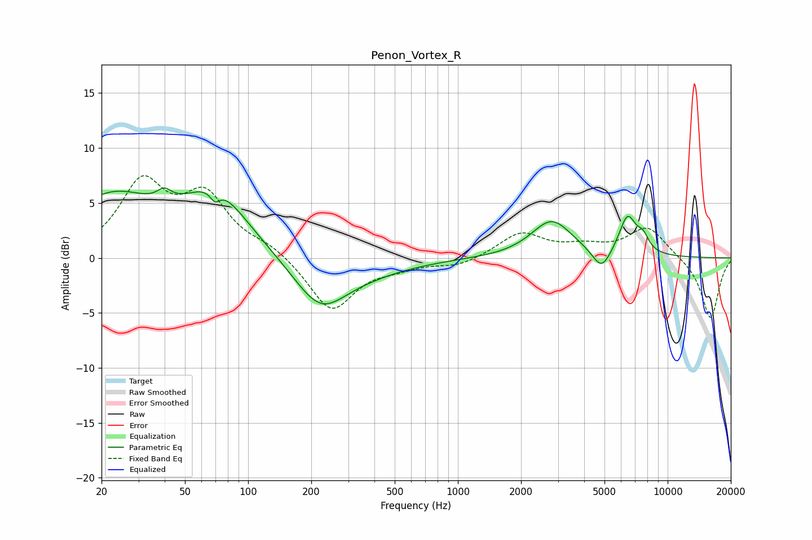

# Penon_Vortex_R
See [usage instructions](https://github.com/jaakkopasanen/AutoEq#usage) for more options and info.

### Parametric EQs
Apply preamp of -6.5 dB when using parametric equalizer.

|   # | Type    |   Fc (Hz) |    Q |   Gain (dB) |
|-----|---------|-----------|------|-------------|
|   1 | Peaking |        22 | 0.67 |         5.3 |
|   2 | Peaking |        40 | 4.27 |         1   |
|   3 | Peaking |        69 | 5.98 |        -1.1 |
|   4 | Peaking |        70 | 0.93 |         5.4 |
|   5 | Peaking |       220 | 1.13 |        -4.2 |
|   6 | Peaking |       355 | 0.66 |        -1   |
|   7 | Peaking |      2802 | 1.45 |         3.4 |
|   8 | Peaking |      4842 | 3.16 |        -2   |
|   9 | Peaking |      6442 | 3.3  |         3.5 |
|  10 | Peaking |      7630 | 4.73 |         1.2 |

### Fixed Band EQs
When using fixed band (also called graphic) equalizer, apply preamp of **-7.6 dB** (if available) and set gains manually with these parameters.

|   # | Type    |   Fc (Hz) |    Q |   Gain (dB) |
|-----|---------|-----------|------|-------------|
|   1 | Peaking |        31 | 1.41 |         6.5 |
|   2 | Peaking |        62 | 1.41 |         5.1 |
|   3 | Peaking |       125 | 1.41 |         1   |
|   4 | Peaking |       250 | 1.41 |        -4.9 |
|   5 | Peaking |       500 | 1.41 |        -0.6 |
|   6 | Peaking |      1000 | 1.41 |        -0.7 |
|   7 | Peaking |      2000 | 1.41 |         2.2 |
|   8 | Peaking |      4000 | 1.41 |         0.8 |
|   9 | Peaking |      8000 | 1.41 |         2.8 |
|  10 | Peaking |     16000 | 1.41 |        -5.6 |

### Graphs

