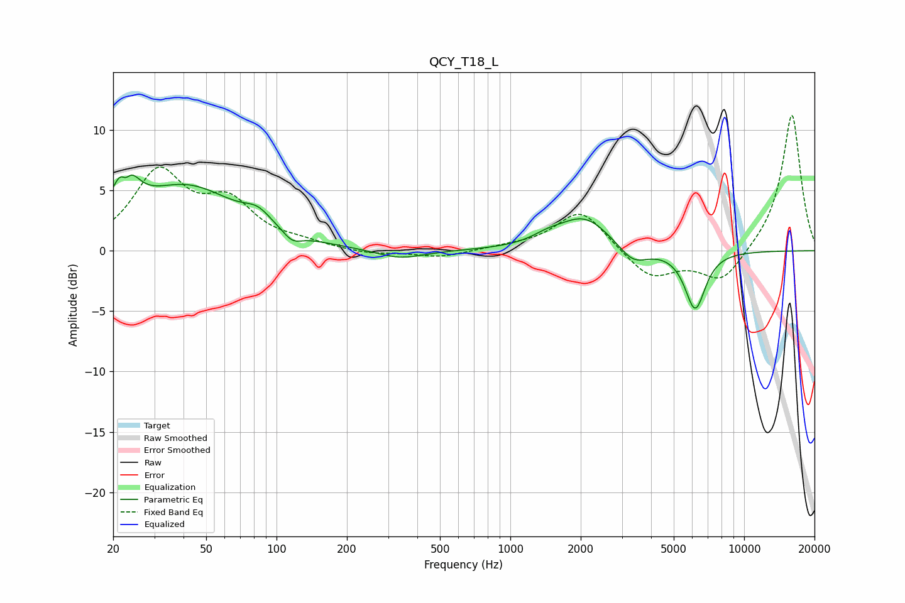

# QCY_T18_L
See [usage instructions](https://github.com/jaakkopasanen/AutoEq#usage) for more options and info.

### Parametric EQs
Apply preamp of -6.4 dB when using parametric equalizer.

|   # | Type    |   Fc (Hz) |    Q |   Gain (dB) |
|-----|---------|-----------|------|-------------|
|   1 | Peaking |        22 | 3.35 |         5.6 |
|   2 | Peaking |        23 | 5.98 |        -2.6 |
|   3 | Peaking |        41 | 0.64 |         5.2 |
|   4 | Peaking |        83 | 2.47 |         1.1 |
|   5 | Peaking |       117 | 3.54 |        -0.9 |
|   6 | Peaking |       339 | 1.37 |        -0.8 |
|   7 | Peaking |      1444 | 2.07 |         0.6 |
|   8 | Peaking |      2076 | 1.29 |         2.7 |
|   9 | Peaking |      3349 | 2.25 |        -1.5 |
|  10 | Peaking |      6176 | 3.14 |        -4.8 |

### Fixed Band EQs
When using fixed band (also called graphic) equalizer, apply preamp of **-11.3 dB** (if available) and set gains manually with these parameters.

|   # | Type    |   Fc (Hz) |    Q |   Gain (dB) |
|-----|---------|-----------|------|-------------|
|   1 | Peaking |        31 | 1.41 |         6.3 |
|   2 | Peaking |        62 | 1.41 |         3.5 |
|   3 | Peaking |       125 | 1.41 |         0.5 |
|   4 | Peaking |       250 | 1.41 |        -0.3 |
|   5 | Peaking |       500 | 1.41 |        -0.6 |
|   6 | Peaking |      1000 | 1.41 |         0.2 |
|   7 | Peaking |      2000 | 1.41 |         3.4 |
|   8 | Peaking |      4000 | 1.41 |        -2.4 |
|   9 | Peaking |      8000 | 1.41 |        -2.7 |
|  10 | Peaking |     16000 | 1.41 |        11.4 |

### Graphs

