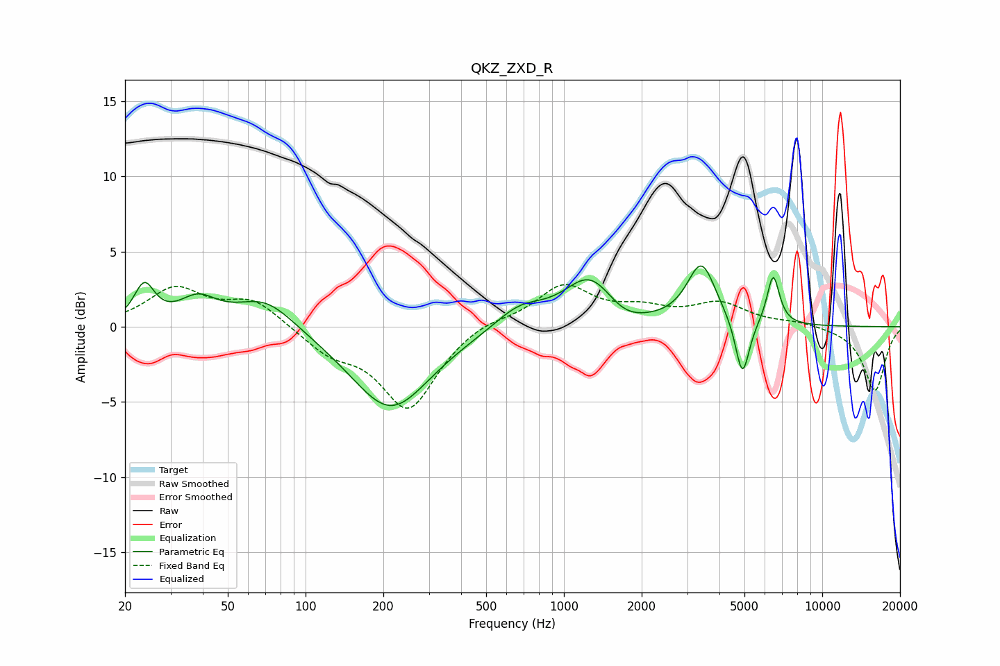

# QKZ_ZXD_R
See [usage instructions](https://github.com/jaakkopasanen/AutoEq#usage) for more options and info.

### Parametric EQs
Apply preamp of -4.1 dB when using parametric equalizer.

|   # | Type    |   Fc (Hz) |    Q |   Gain (dB) |
|-----|---------|-----------|------|-------------|
|   1 | Peaking |        24 | 3.65 |         2.5 |
|   2 | Peaking |        38 | 1.94 |         1.6 |
|   3 | Peaking |        70 | 1.24 |         2.1 |
|   4 | Peaking |       213 | 0.92 |        -5.5 |
|   5 | Peaking |       674 | 1.46 |         1.4 |
|   6 | Peaking |      1265 | 1.41 |         3.3 |
|   7 | Peaking |      1694 | 1.77 |        -0.9 |
|   8 | Peaking |      3407 | 2.54 |         4   |
|   9 | Peaking |      4910 | 5.19 |        -4   |
|  10 | Peaking |      6458 | 5.69 |         3.3 |

### Fixed Band EQs
When using fixed band (also called graphic) equalizer, apply preamp of **-2.9 dB** (if available) and set gains manually with these parameters.

|   # | Type    |   Fc (Hz) |    Q |   Gain (dB) |
|-----|---------|-----------|------|-------------|
|   1 | Peaking |        31 | 1.41 |         2.5 |
|   2 | Peaking |        62 | 1.41 |         1.7 |
|   3 | Peaking |       125 | 1.41 |        -1.5 |
|   4 | Peaking |       250 | 1.41 |        -5.4 |
|   5 | Peaking |       500 | 1.41 |         0.6 |
|   6 | Peaking |      1000 | 1.41 |         2.7 |
|   7 | Peaking |      2000 | 1.41 |         1   |
|   8 | Peaking |      4000 | 1.41 |         1.4 |
|   9 | Peaking |      8000 | 1.41 |         0.3 |
|  10 | Peaking |     16000 | 1.41 |        -4.3 |

### Graphs

