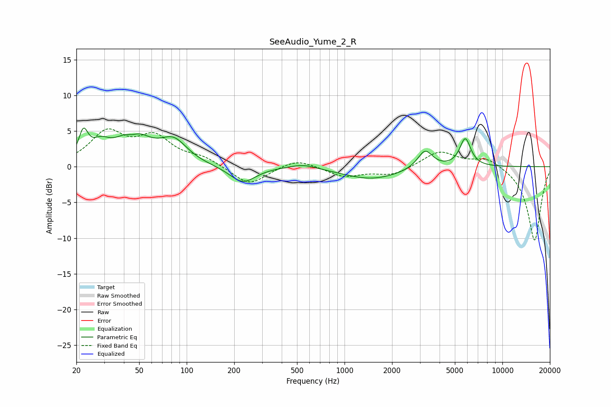

# SeeAudio_Yume_2_R
See [usage instructions](https://github.com/jaakkopasanen/AutoEq#usage) for more options and info.

### Parametric EQs
Apply preamp of -5.5 dB when using parametric equalizer.

|   # | Type    |   Fc (Hz) |    Q |   Gain (dB) |
|-----|---------|-----------|------|-------------|
|   1 | Peaking |        22 | 4.77 |         3.8 |
|   2 | Peaking |        28 | 2.48 |         2   |
|   3 | Peaking |        45 | 3.81 |        -0.9 |
|   4 | Peaking |        45 | 1.42 |         4.5 |
|   5 | Peaking |        83 | 1.64 |         3.1 |
|   6 | Peaking |       226 | 1.74 |        -2.3 |
|   7 | Peaking |       547 | 1.59 |         0.7 |
|   8 | Peaking |      1487 | 0.78 |        -1.7 |
|   9 | Peaking |      3237 | 2.96 |         2.6 |
|  10 | Peaking |      5816 | 3.98 |         3.9 |

### Fixed Band EQs
When using fixed band (also called graphic) equalizer, apply preamp of **-5.4 dB** (if available) and set gains manually with these parameters.

|   # | Type    |   Fc (Hz) |    Q |   Gain (dB) |
|-----|---------|-----------|------|-------------|
|   1 | Peaking |        31 | 1.41 |         4.6 |
|   2 | Peaking |        62 | 1.41 |         3.8 |
|   3 | Peaking |       125 | 1.41 |         1.1 |
|   4 | Peaking |       250 | 1.41 |        -2.7 |
|   5 | Peaking |       500 | 1.41 |         1.2 |
|   6 | Peaking |      1000 | 1.41 |        -1.4 |
|   7 | Peaking |      2000 | 1.41 |        -1.2 |
|   8 | Peaking |      4000 | 1.41 |         2.2 |
|   9 | Peaking |      8000 | 1.41 |         1.3 |
|  10 | Peaking |     16000 | 1.41 |       -10.4 |

### Graphs

