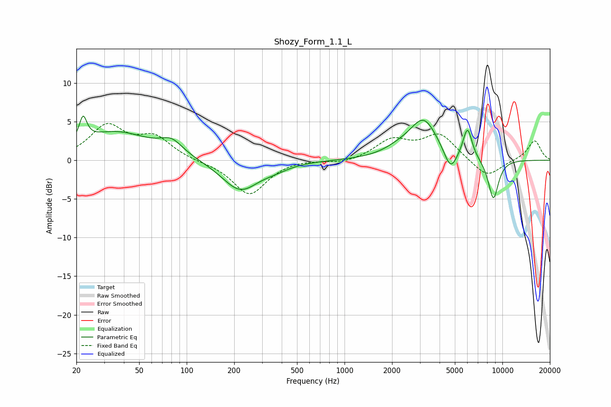

# Shozy_Form_1.1_L
See [usage instructions](https://github.com/jaakkopasanen/AutoEq#usage) for more options and info.

### Parametric EQs
Apply preamp of -5.8 dB when using parametric equalizer.

|   # | Type    |   Fc (Hz) |    Q |   Gain (dB) |
|-----|---------|-----------|------|-------------|
|   1 | Peaking |        22 | 5.99 |         3.1 |
|   2 | Peaking |        35 | 0.62 |         3.6 |
|   3 | Peaking |        80 | 2.03 |         1.7 |
|   4 | Peaking |       218 | 1.21 |        -4   |
|   5 | Peaking |       365 | 1.7  |        -0.5 |
|   6 | Peaking |      2217 | 1.41 |         0.8 |
|   7 | Peaking |      3176 | 1.6  |         5   |
|   8 | Peaking |      4691 | 3.44 |        -2.8 |
|   9 | Peaking |      6011 | 4.69 |         4   |
|  10 | Peaking |      8771 | 3.86 |        -5.2 |

### Fixed Band EQs
When using fixed band (also called graphic) equalizer, apply preamp of **-4.8 dB** (if available) and set gains manually with these parameters.

|   # | Type    |   Fc (Hz) |    Q |   Gain (dB) |
|-----|---------|-----------|------|-------------|
|   1 | Peaking |        31 | 1.41 |         4.3 |
|   2 | Peaking |        62 | 1.41 |         2.8 |
|   3 | Peaking |       125 | 1.41 |        -0.2 |
|   4 | Peaking |       250 | 1.41 |        -4.5 |
|   5 | Peaking |       500 | 1.41 |         0.2 |
|   6 | Peaking |      1000 | 1.41 |        -0.4 |
|   7 | Peaking |      2000 | 1.41 |         2.5 |
|   8 | Peaking |      4000 | 1.41 |         3.3 |
|   9 | Peaking |      8000 | 1.41 |        -2.3 |
|  10 | Peaking |     16000 | 1.41 |         2.6 |

### Graphs

