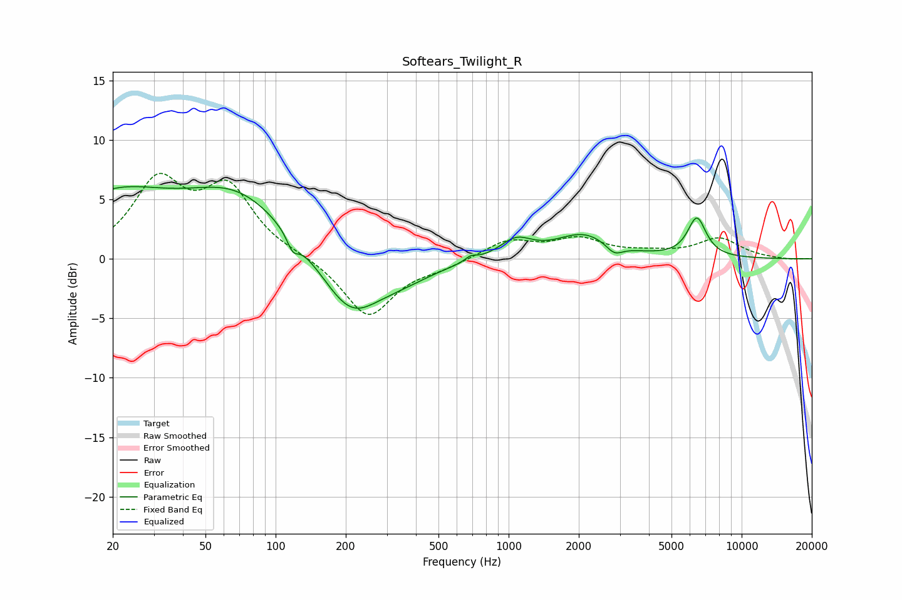

# Softears_Twilight_R
See [usage instructions](https://github.com/jaakkopasanen/AutoEq#usage) for more options and info.

### Parametric EQs
Apply preamp of -6.2 dB when using parametric equalizer.

|   # | Type    |   Fc (Hz) |    Q |   Gain (dB) |
|-----|---------|-----------|------|-------------|
|   1 | Peaking |        20 | 0.57 |         4.9 |
|   2 | Peaking |        69 | 0.64 |         5   |
|   3 | Peaking |       118 | 5.93 |        -1.2 |
|   4 | Peaking |       210 | 1.11 |        -4.9 |
|   5 | Peaking |       354 | 1.01 |        -1.2 |
|   6 | Peaking |       688 | 5.63 |         0.4 |
|   7 | Peaking |      1074 | 2.05 |         1.5 |
|   8 | Peaking |      2097 | 1.19 |         2   |
|   9 | Peaking |      2840 | 3.99 |        -0.9 |
|  10 | Peaking |      6424 | 3.44 |         3.3 |

### Fixed Band EQs
When using fixed band (also called graphic) equalizer, apply preamp of **-7.3 dB** (if available) and set gains manually with these parameters.

|   # | Type    |   Fc (Hz) |    Q |   Gain (dB) |
|-----|---------|-----------|------|-------------|
|   1 | Peaking |        31 | 1.41 |         6.1 |
|   2 | Peaking |        62 | 1.41 |         5.5 |
|   3 | Peaking |       125 | 1.41 |         0.2 |
|   4 | Peaking |       250 | 1.41 |        -4.9 |
|   5 | Peaking |       500 | 1.41 |        -0.6 |
|   6 | Peaking |      1000 | 1.41 |         1.5 |
|   7 | Peaking |      2000 | 1.41 |         1.5 |
|   8 | Peaking |      4000 | 1.41 |         0.4 |
|   9 | Peaking |      8000 | 1.41 |         1.7 |
|  10 | Peaking |     16000 | 1.41 |        -0.1 |

### Graphs

