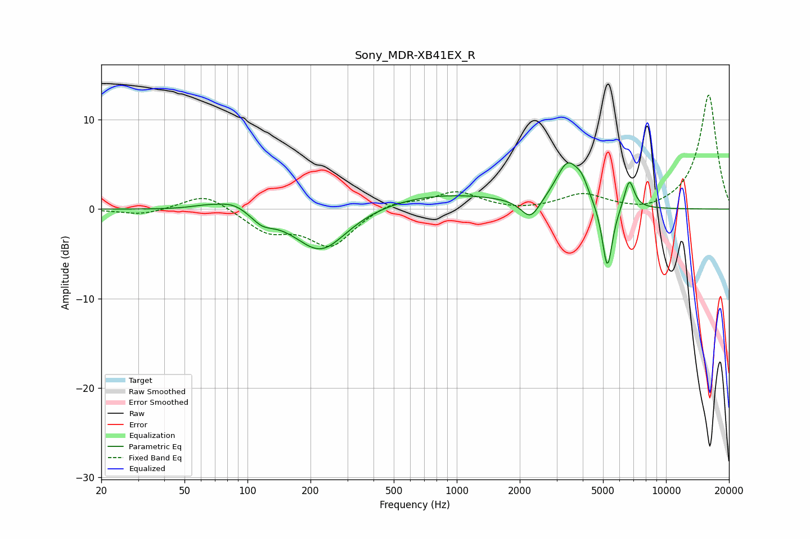

# Sony_MDR-XB41EX_R
See [usage instructions](https://github.com/jaakkopasanen/AutoEq#usage) for more options and info.

### Parametric EQs
Apply preamp of -5.3 dB when using parametric equalizer.

|   # | Type    |   Fc (Hz) |    Q |   Gain (dB) |
|-----|---------|-----------|------|-------------|
|   1 | Peaking |        63 | 1.77 |         0.4 |
|   2 | Peaking |        86 | 1.79 |         1.1 |
|   3 | Peaking |       117 | 2.59 |        -1.1 |
|   4 | Peaking |       224 | 1.13 |        -4.9 |
|   5 | Peaking |       836 | 0.44 |         1.7 |
|   6 | Peaking |      2250 | 3.12 |        -2.3 |
|   7 | Peaking |      3392 | 2.42 |         4.8 |
|   8 | Peaking |      3965 | 4.64 |         1.4 |
|   9 | Peaking |      5243 | 5.64 |        -7.5 |
|  10 | Peaking |      6676 | 5.77 |         3.3 |

### Fixed Band EQs
When using fixed band (also called graphic) equalizer, apply preamp of **-12.9 dB** (if available) and set gains manually with these parameters.

|   # | Type    |   Fc (Hz) |    Q |   Gain (dB) |
|-----|---------|-----------|------|-------------|
|   1 | Peaking |        31 | 1.41 |        -0.7 |
|   2 | Peaking |        62 | 1.41 |         1.9 |
|   3 | Peaking |       125 | 1.41 |        -2.4 |
|   4 | Peaking |       250 | 1.41 |        -4   |
|   5 | Peaking |       500 | 1.41 |         1   |
|   6 | Peaking |      1000 | 1.41 |         1.9 |
|   7 | Peaking |      2000 | 1.41 |        -0.3 |
|   8 | Peaking |      4000 | 1.41 |         1.6 |
|   9 | Peaking |      8000 | 1.41 |        -0.5 |
|  10 | Peaking |     16000 | 1.41 |        12.9 |

### Graphs

