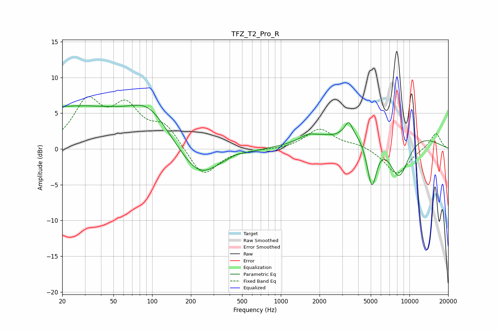

# TFZ_T2_Pro_R
See [usage instructions](https://github.com/jaakkopasanen/AutoEq#usage) for more options and info.

### Parametric EQs
Apply preamp of -6.2 dB when using parametric equalizer.

|   # | Type    |   Fc (Hz) |    Q |   Gain (dB) |
|-----|---------|-----------|------|-------------|
|   1 | Peaking |        23 | 0.24 |         5.8 |
|   2 | Peaking |        94 | 1.01 |         3.5 |
|   3 | Peaking |       233 | 0.93 |        -4.5 |
|   4 | Peaking |       444 | 2.96 |         0.2 |
|   5 | Peaking |      1626 | 2.07 |         0.8 |
|   6 | Peaking |      2600 | 3.86 |        -0.3 |
|   7 | Peaking |      3377 | 5.27 |         1.7 |
|   8 | Peaking |      5100 | 3.48 |        -7.3 |
|   9 | Peaking |      6326 | 0.35 |         4.2 |
|  10 | Peaking |      8254 | 1.5  |        -7.2 |

### Fixed Band EQs
When using fixed band (also called graphic) equalizer, apply preamp of **-7.4 dB** (if available) and set gains manually with these parameters.

|   # | Type    |   Fc (Hz) |    Q |   Gain (dB) |
|-----|---------|-----------|------|-------------|
|   1 | Peaking |        31 | 1.41 |         6.2 |
|   2 | Peaking |        62 | 1.41 |         5.2 |
|   3 | Peaking |       125 | 1.41 |         3   |
|   4 | Peaking |       250 | 1.41 |        -4   |
|   5 | Peaking |       500 | 1.41 |        -0.1 |
|   6 | Peaking |      1000 | 1.41 |        -0.1 |
|   7 | Peaking |      2000 | 1.41 |         2.8 |
|   8 | Peaking |      4000 | 1.41 |         0.6 |
|   9 | Peaking |      8000 | 1.41 |        -3.6 |
|  10 | Peaking |     16000 | 1.41 |         2.3 |

### Graphs

