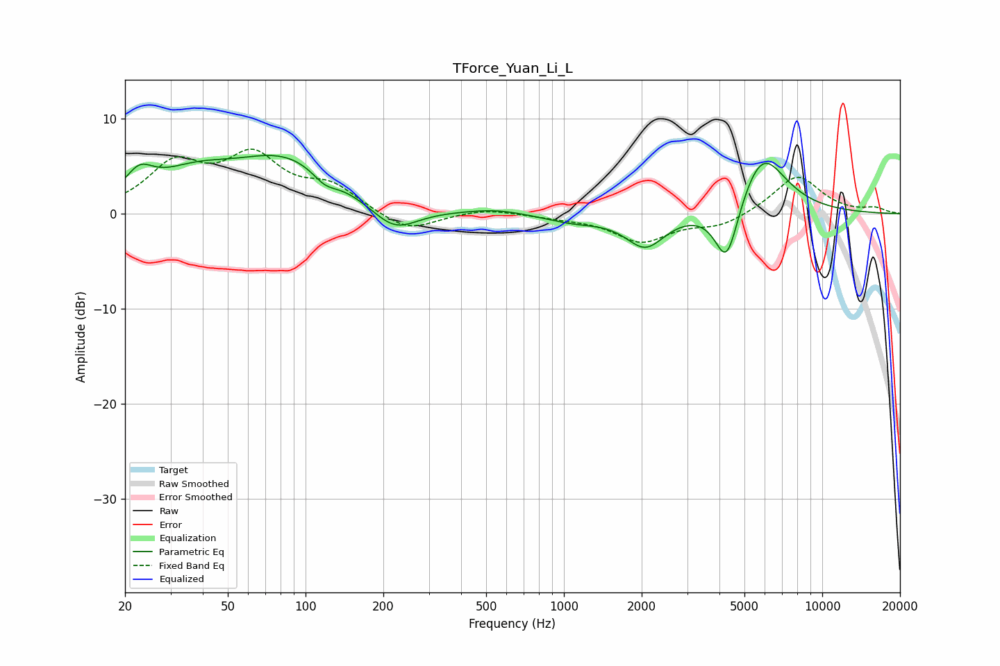

# TForce_Yuan_Li_L
See [usage instructions](https://github.com/jaakkopasanen/AutoEq#usage) for more options and info.

### Parametric EQs
Apply preamp of -6.2 dB when using parametric equalizer.

|   # | Type    |   Fc (Hz) |    Q |   Gain (dB) |
|-----|---------|-----------|------|-------------|
|   1 | Peaking |        23 | 2.63 |         2.6 |
|   2 | Peaking |        36 | 0.88 |         3   |
|   3 | Peaking |        84 | 0.69 |         5.5 |
|   4 | Peaking |       119 | 2.98 |        -1.2 |
|   5 | Peaking |       220 | 1.54 |        -2.8 |
|   6 | Peaking |       547 | 1.3  |         0.5 |
|   7 | Peaking |      1086 | 1.24 |        -0.8 |
|   8 | Peaking |      2069 | 1.86 |        -3.5 |
|   9 | Peaking |      4269 | 2.94 |        -6.8 |
|  10 | Peaking |      5843 | 1.48 |         6.7 |

### Fixed Band EQs
When using fixed band (also called graphic) equalizer, apply preamp of **-6.9 dB** (if available) and set gains manually with these parameters.

|   # | Type    |   Fc (Hz) |    Q |   Gain (dB) |
|-----|---------|-----------|------|-------------|
|   1 | Peaking |        31 | 1.41 |         4.8 |
|   2 | Peaking |        62 | 1.41 |         5.5 |
|   3 | Peaking |       125 | 1.41 |         2.6 |
|   4 | Peaking |       250 | 1.41 |        -2   |
|   5 | Peaking |       500 | 1.41 |         0.6 |
|   6 | Peaking |      1000 | 1.41 |        -0.3 |
|   7 | Peaking |      2000 | 1.41 |        -2.9 |
|   8 | Peaking |      4000 | 1.41 |        -1.3 |
|   9 | Peaking |      8000 | 1.41 |         4.1 |
|  10 | Peaking |     16000 | 1.41 |         0.5 |

### Graphs

