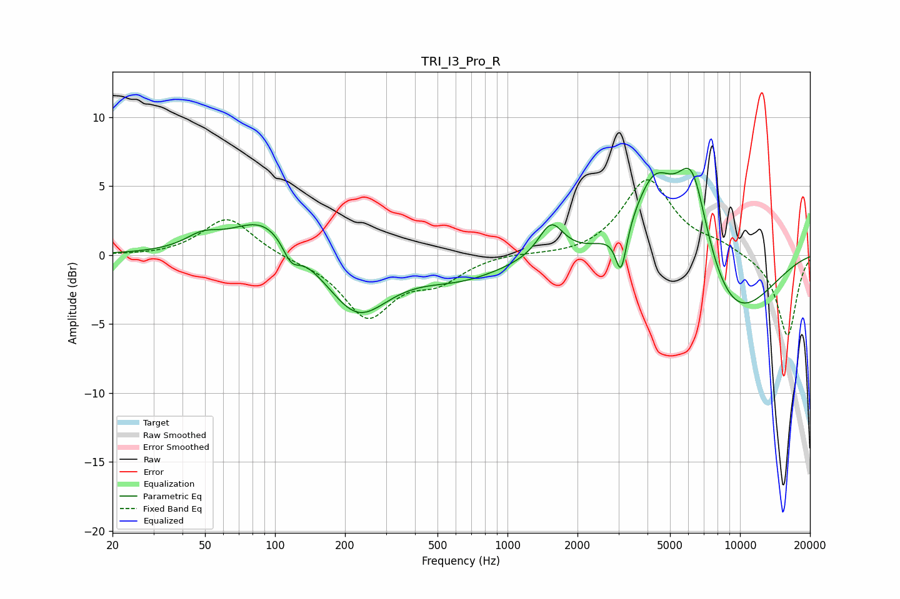

# TRI_I3_Pro_R
See [usage instructions](https://github.com/jaakkopasanen/AutoEq#usage) for more options and info.

### Parametric EQs
Apply preamp of -6.4 dB when using parametric equalizer.

|   # | Type    |   Fc (Hz) |    Q |   Gain (dB) |
|-----|---------|-----------|------|-------------|
|   1 | Peaking |        49 | 1.94 |         0.9 |
|   2 | Peaking |        91 | 1    |         3   |
|   3 | Peaking |       117 | 3.76 |        -1.5 |
|   4 | Peaking |       225 | 1.05 |        -4.3 |
|   5 | Peaking |       633 | 0.74 |        -1.5 |
|   6 | Peaking |      1540 | 2.66 |         2.5 |
|   7 | Peaking |      3079 | 5.99 |        -3.3 |
|   8 | Peaking |      4285 | 1.5  |         5.8 |
|   9 | Peaking |      6232 | 1.88 |         7.5 |
|  10 | Peaking |      9001 | 0.67 |        -5.3 |

### Fixed Band EQs
When using fixed band (also called graphic) equalizer, apply preamp of **-5.5 dB** (if available) and set gains manually with these parameters.

|   # | Type    |   Fc (Hz) |    Q |   Gain (dB) |
|-----|---------|-----------|------|-------------|
|   1 | Peaking |        31 | 1.41 |        -0.1 |
|   2 | Peaking |        62 | 1.41 |         2.8 |
|   3 | Peaking |       125 | 1.41 |        -0.2 |
|   4 | Peaking |       250 | 1.41 |        -4.4 |
|   5 | Peaking |       500 | 1.41 |        -1.6 |
|   6 | Peaking |      1000 | 1.41 |         0.2 |
|   7 | Peaking |      2000 | 1.41 |        -0.1 |
|   8 | Peaking |      4000 | 1.41 |         5.5 |
|   9 | Peaking |      8000 | 1.41 |         0.7 |
|  10 | Peaking |     16000 | 1.41 |        -5.9 |

### Graphs

