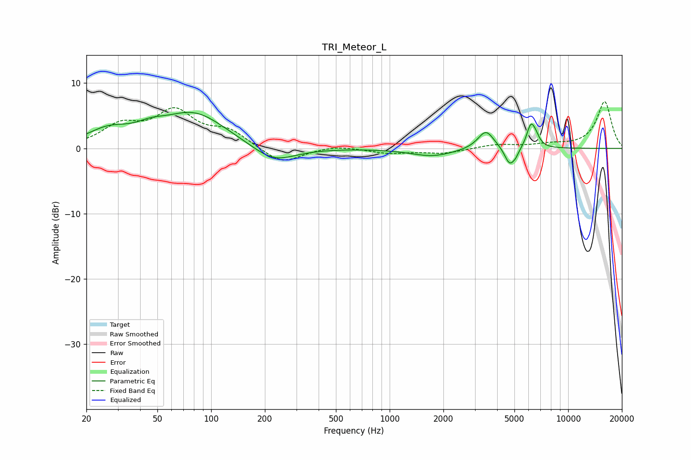

# TRI_Meteor_L
See [usage instructions](https://github.com/jaakkopasanen/AutoEq#usage) for more options and info.

### Parametric EQs
Apply preamp of -5.6 dB when using parametric equalizer.

|   # | Type    |   Fc (Hz) |    Q |   Gain (dB) |
|-----|---------|-----------|------|-------------|
|   1 | Peaking |        26 | 1.21 |         2.3 |
|   2 | Peaking |        46 | 1.78 |         1.1 |
|   3 | Peaking |        80 | 0.78 |         5.3 |
|   4 | Peaking |       224 | 1.17 |        -2.6 |
|   5 | Peaking |      1736 | 1.16 |        -1.2 |
|   6 | Peaking |      3462 | 3.11 |         2.9 |
|   7 | Peaking |      4685 | 5.07 |        -2.4 |
|   8 | Peaking |      5060 | 6    |        -1   |
|   9 | Peaking |      6171 | 5.81 |         3.3 |
|  10 | Peaking |      6571 | 5.96 |         1.2 |

### Fixed Band EQs
When using fixed band (also called graphic) equalizer, apply preamp of **-7.2 dB** (if available) and set gains manually with these parameters.

|   # | Type    |   Fc (Hz) |    Q |   Gain (dB) |
|-----|---------|-----------|------|-------------|
|   1 | Peaking |        31 | 1.41 |         3.2 |
|   2 | Peaking |        62 | 1.41 |         5.3 |
|   3 | Peaking |       125 | 1.41 |         2.4 |
|   4 | Peaking |       250 | 1.41 |        -2.5 |
|   5 | Peaking |       500 | 1.41 |         0.5 |
|   6 | Peaking |      1000 | 1.41 |        -0.7 |
|   7 | Peaking |      2000 | 1.41 |        -0.7 |
|   8 | Peaking |      4000 | 1.41 |         0.6 |
|   9 | Peaking |      8000 | 1.41 |         0.5 |
|  10 | Peaking |     16000 | 1.41 |         7.2 |

### Graphs

