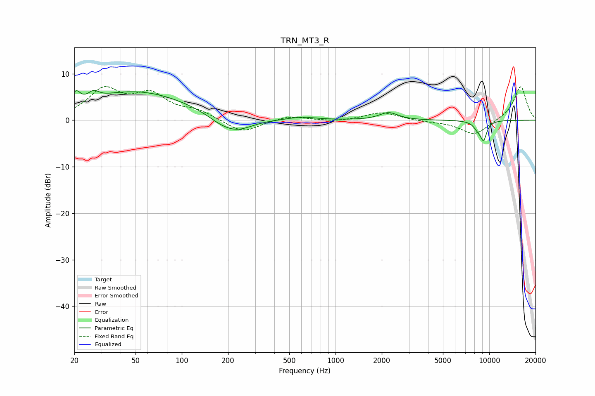

# TRN_MT3_R
See [usage instructions](https://github.com/jaakkopasanen/AutoEq#usage) for more options and info.

### Parametric EQs
Apply preamp of -6.5 dB when using parametric equalizer.

|   # | Type    |   Fc (Hz) |    Q |   Gain (dB) |
|-----|---------|-----------|------|-------------|
|   1 | Peaking |        20 | 5.58 |         2.5 |
|   2 | Peaking |        26 | 5.93 |        -0.5 |
|   3 | Peaking |        27 | 4.7  |         2   |
|   4 | Peaking |        50 | 0.4  |         6.2 |
|   5 | Peaking |       180 | 1.47 |        -1.5 |
|   6 | Peaking |       231 | 1.35 |        -2.6 |
|   7 | Peaking |       601 | 1.59 |         0.7 |
|   8 | Peaking |      2218 | 2.38 |         1.6 |
|   9 | Peaking |      8433 | 4.56 |        -1.4 |
|  10 | Peaking |      9188 | 5.99 |        -3.7 |

### Fixed Band EQs
When using fixed band (also called graphic) equalizer, apply preamp of **-7.3 dB** (if available) and set gains manually with these parameters.

|   # | Type    |   Fc (Hz) |    Q |   Gain (dB) |
|-----|---------|-----------|------|-------------|
|   1 | Peaking |        31 | 1.41 |         6.2 |
|   2 | Peaking |        62 | 1.41 |         4.9 |
|   3 | Peaking |       125 | 1.41 |         1.7 |
|   4 | Peaking |       250 | 1.41 |        -2.8 |
|   5 | Peaking |       500 | 1.41 |         1   |
|   6 | Peaking |      1000 | 1.41 |        -0.4 |
|   7 | Peaking |      2000 | 1.41 |         1.7 |
|   8 | Peaking |      4000 | 1.41 |        -0.3 |
|   9 | Peaking |      8000 | 1.41 |        -3.2 |
|  10 | Peaking |     16000 | 1.41 |         7.4 |

### Graphs

