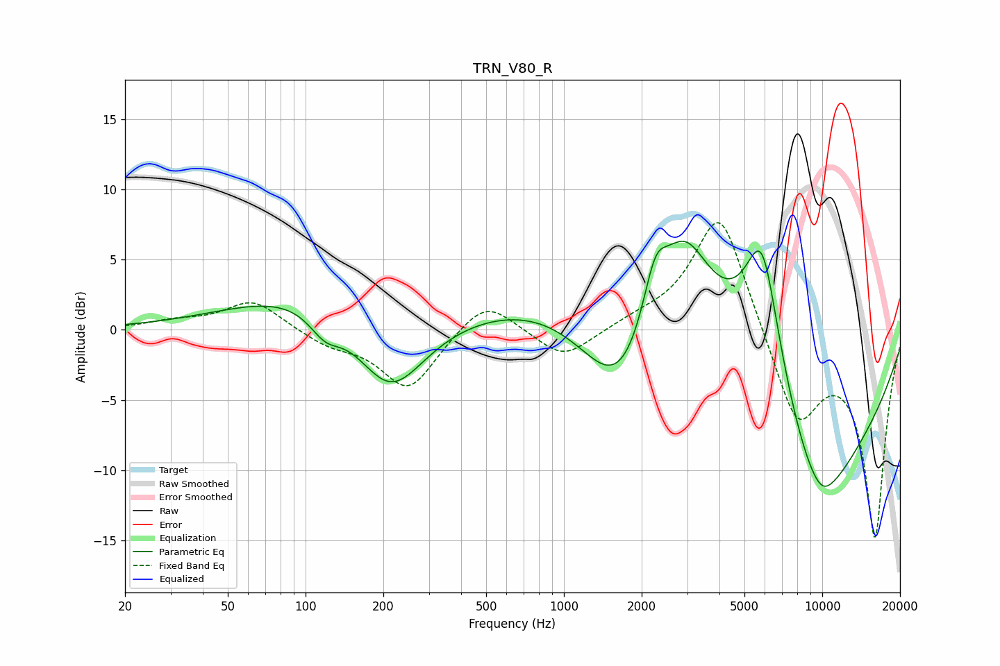

# TRN_V80_R
See [usage instructions](https://github.com/jaakkopasanen/AutoEq#usage) for more options and info.

### Parametric EQs
Apply preamp of -6.4 dB when using parametric equalizer.

|   # | Type    |   Fc (Hz) |    Q |   Gain (dB) |
|-----|---------|-----------|------|-------------|
|   1 | Peaking |       118 | 0.44 |         3.3 |
|   2 | Peaking |       119 | 2.27 |        -1.7 |
|   3 | Peaking |       212 | 1    |        -6.5 |
|   4 | Peaking |      1649 | 0.83 |        -9.2 |
|   5 | Peaking |      2253 | 2.94 |         4.1 |
|   6 | Peaking |      2922 | 1.37 |         6.7 |
|   7 | Peaking |      3312 | 0.2  |         7.2 |
|   8 | Peaking |      5851 | 1.83 |        10.6 |
|   9 | Peaking |      9407 | 0.46 |       -17.1 |
|  10 | Peaking |      9980 | 2.74 |        -0.6 |

### Fixed Band EQs
When using fixed band (also called graphic) equalizer, apply preamp of **-7.7 dB** (if available) and set gains manually with these parameters.

|   # | Type    |   Fc (Hz) |    Q |   Gain (dB) |
|-----|---------|-----------|------|-------------|
|   1 | Peaking |        31 | 1.41 |         0.5 |
|   2 | Peaking |        62 | 1.41 |         2.1 |
|   3 | Peaking |       125 | 1.41 |        -1   |
|   4 | Peaking |       250 | 1.41 |        -4.3 |
|   5 | Peaking |       500 | 1.41 |         2.4 |
|   6 | Peaking |      1000 | 1.41 |        -2.2 |
|   7 | Peaking |      2000 | 1.41 |         0.5 |
|   8 | Peaking |      4000 | 1.41 |         8.8 |
|   9 | Peaking |      8000 | 1.41 |        -6.6 |
|  10 | Peaking |     16000 | 1.41 |       -14.7 |

### Graphs

