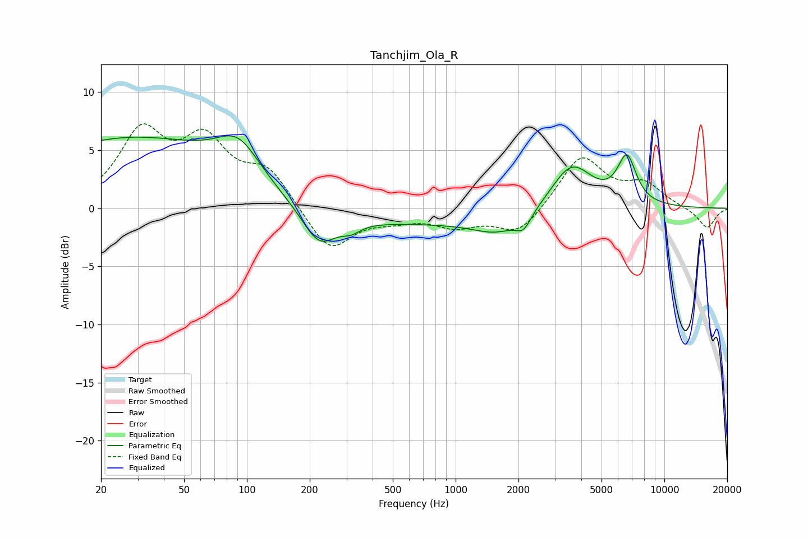

# Tanchjim_Ola_R
See [usage instructions](https://github.com/jaakkopasanen/AutoEq#usage) for more options and info.

### Parametric EQs
Apply preamp of -6.3 dB when using parametric equalizer.

|   # | Type    |   Fc (Hz) |    Q |   Gain (dB) |
|-----|---------|-----------|------|-------------|
|   1 | Peaking |        28 | 0.27 |         6   |
|   2 | Peaking |        91 | 1.35 |         3.2 |
|   3 | Peaking |       222 | 1.77 |        -3   |
|   4 | Peaking |       316 | 3.13 |        -0.7 |
|   5 | Peaking |       503 | 0.18 |        -1.3 |
|   6 | Peaking |      1600 | 1.21 |        -1.4 |
|   7 | Peaking |      2116 | 3.93 |        -1.2 |
|   8 | Peaking |      3593 | 1.4  |         4.1 |
|   9 | Peaking |      6525 | 4.06 |        -1   |
|  10 | Peaking |      6588 | 3.21 |         5   |

### Fixed Band EQs
When using fixed band (also called graphic) equalizer, apply preamp of **-7.4 dB** (if available) and set gains manually with these parameters.

|   # | Type    |   Fc (Hz) |    Q |   Gain (dB) |
|-----|---------|-----------|------|-------------|
|   1 | Peaking |        31 | 1.41 |         6.2 |
|   2 | Peaking |        62 | 1.41 |         5.2 |
|   3 | Peaking |       125 | 1.41 |         3.1 |
|   4 | Peaking |       250 | 1.41 |        -3.8 |
|   5 | Peaking |       500 | 1.41 |        -0.7 |
|   6 | Peaking |      1000 | 1.41 |        -1.4 |
|   7 | Peaking |      2000 | 1.41 |        -2.3 |
|   8 | Peaking |      4000 | 1.41 |         4.5 |
|   9 | Peaking |      8000 | 1.41 |         1.9 |
|  10 | Peaking |     16000 | 1.41 |        -1.8 |

### Graphs

