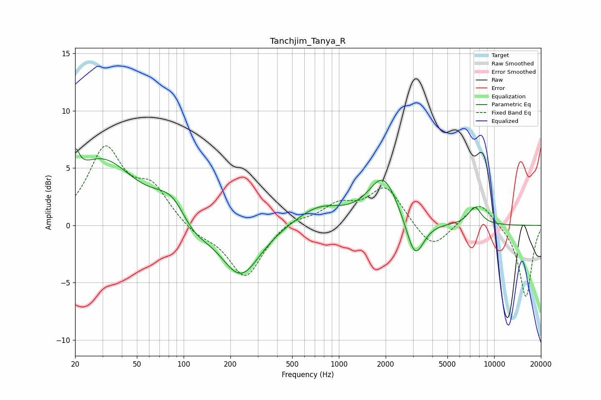

# Tanchjim_Tanya_R
See [usage instructions](https://github.com/jaakkopasanen/AutoEq#usage) for more options and info.

### Parametric EQs
Apply preamp of -6.8 dB when using parametric equalizer.

|   # | Type    |   Fc (Hz) |    Q |   Gain (dB) |
|-----|---------|-----------|------|-------------|
|   1 | Peaking |        20 | 5.45 |         2.3 |
|   2 | Peaking |        29 | 0.67 |         5.6 |
|   3 | Peaking |        74 | 1.46 |         0.9 |
|   4 | Peaking |        89 | 1.7  |         1.5 |
|   5 | Peaking |       113 | 1.38 |        -1.3 |
|   6 | Peaking |       233 | 1.14 |        -4.5 |
|   7 | Peaking |       742 | 0.93 |         1.6 |
|   8 | Peaking |      1933 | 1.49 |         4.2 |
|   9 | Peaking |      3089 | 2.49 |        -3.6 |
|  10 | Peaking |      7498 | 3.16 |         1.6 |

### Fixed Band EQs
When using fixed band (also called graphic) equalizer, apply preamp of **-7.0 dB** (if available) and set gains manually with these parameters.

|   # | Type    |   Fc (Hz) |    Q |   Gain (dB) |
|-----|---------|-----------|------|-------------|
|   1 | Peaking |        31 | 1.41 |         6.5 |
|   2 | Peaking |        62 | 1.41 |         2.9 |
|   3 | Peaking |       125 | 1.41 |        -0.8 |
|   4 | Peaking |       250 | 1.41 |        -4.6 |
|   5 | Peaking |       500 | 1.41 |         0.7 |
|   6 | Peaking |      1000 | 1.41 |         1.6 |
|   7 | Peaking |      2000 | 1.41 |         3.3 |
|   8 | Peaking |      4000 | 1.41 |        -2.3 |
|   9 | Peaking |      8000 | 1.41 |         2.2 |
|  10 | Peaking |     16000 | 1.41 |        -6.3 |

### Graphs

