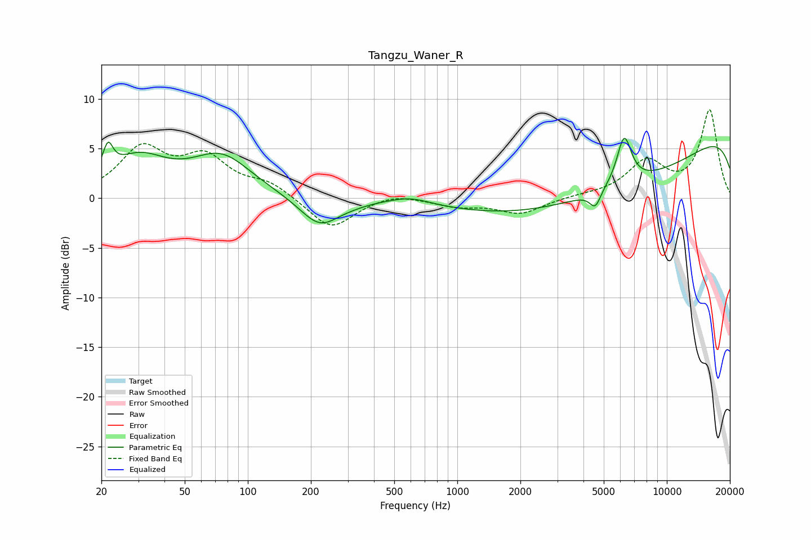

# Tangzu_Waner_R
See [usage instructions](https://github.com/jaakkopasanen/AutoEq#usage) for more options and info.

### Parametric EQs
Apply preamp of -6.1 dB when using parametric equalizer.

|   # | Type    |   Fc (Hz) |    Q |   Gain (dB) |
|-----|---------|-----------|------|-------------|
|   1 | Peaking |        21 | 5.85 |         2.8 |
|   2 | Peaking |        30 | 1.04 |         3.7 |
|   3 | Peaking |        75 | 0.98 |         4   |
|   4 | Peaking |       221 | 1.48 |        -3   |
|   5 | Peaking |       321 | 2.23 |        -0.1 |
|   6 | Peaking |       594 | 1.48 |         0.7 |
|   7 | Peaking |      4555 | 5.27 |        -1.7 |
|   8 | Peaking |      5444 | 0.24 |        -8.1 |
|   9 | Peaking |      6257 | 3.88 |         4.9 |
|  10 | Peaking |     10000 | 0.18 |         9.9 |

### Fixed Band EQs
When using fixed band (also called graphic) equalizer, apply preamp of **-9.0 dB** (if available) and set gains manually with these parameters.

|   # | Type    |   Fc (Hz) |    Q |   Gain (dB) |
|-----|---------|-----------|------|-------------|
|   1 | Peaking |        31 | 1.41 |         4.8 |
|   2 | Peaking |        62 | 1.41 |         3.7 |
|   3 | Peaking |       125 | 1.41 |         1.4 |
|   4 | Peaking |       250 | 1.41 |        -3.2 |
|   5 | Peaking |       500 | 1.41 |         0.6 |
|   6 | Peaking |      1000 | 1.41 |        -0.7 |
|   7 | Peaking |      2000 | 1.41 |        -1.5 |
|   8 | Peaking |      4000 | 1.41 |         0.2 |
|   9 | Peaking |      8000 | 1.41 |         3.5 |
|  10 | Peaking |     16000 | 1.41 |         8.8 |

### Graphs

