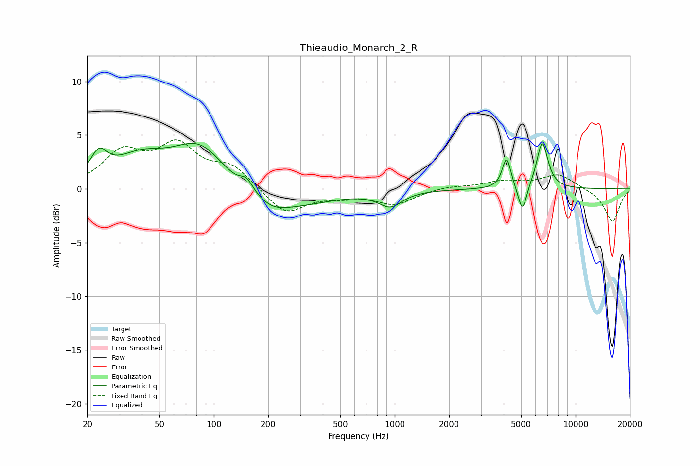

# Thieaudio_Monarch_2_R
See [usage instructions](https://github.com/jaakkopasanen/AutoEq#usage) for more options and info.

### Parametric EQs
Apply preamp of -4.3 dB when using parametric equalizer.

|   # | Type    |   Fc (Hz) |    Q |   Gain (dB) |
|-----|---------|-----------|------|-------------|
|   1 | Peaking |        23 | 3.07 |         2.3 |
|   2 | Peaking |        39 | 0.95 |         2.5 |
|   3 | Peaking |        85 | 0.94 |         4.4 |
|   4 | Peaking |       152 | 3.86 |         1.1 |
|   5 | Peaking |       202 | 0.54 |        -2.3 |
|   6 | Peaking |       216 | 2.09 |        -0.4 |
|   7 | Peaking |       946 | 2.21 |        -1.4 |
|   8 | Peaking |      4158 | 6    |         2.9 |
|   9 | Peaking |      5085 | 5.92 |        -2.6 |
|  10 | Peaking |      6545 | 4.43 |         4.4 |

### Fixed Band EQs
When using fixed band (also called graphic) equalizer, apply preamp of **-4.7 dB** (if available) and set gains manually with these parameters.

|   # | Type    |   Fc (Hz) |    Q |   Gain (dB) |
|-----|---------|-----------|------|-------------|
|   1 | Peaking |        31 | 1.41 |         3.2 |
|   2 | Peaking |        62 | 1.41 |         3.7 |
|   3 | Peaking |       125 | 1.41 |         1.9 |
|   4 | Peaking |       250 | 1.41 |        -2.4 |
|   5 | Peaking |       500 | 1.41 |        -0.5 |
|   6 | Peaking |      1000 | 1.41 |        -1.4 |
|   7 | Peaking |      2000 | 1.41 |         0.3 |
|   8 | Peaking |      4000 | 1.41 |         0.7 |
|   9 | Peaking |      8000 | 1.41 |         1.4 |
|  10 | Peaking |     16000 | 1.41 |        -3.1 |

### Graphs

