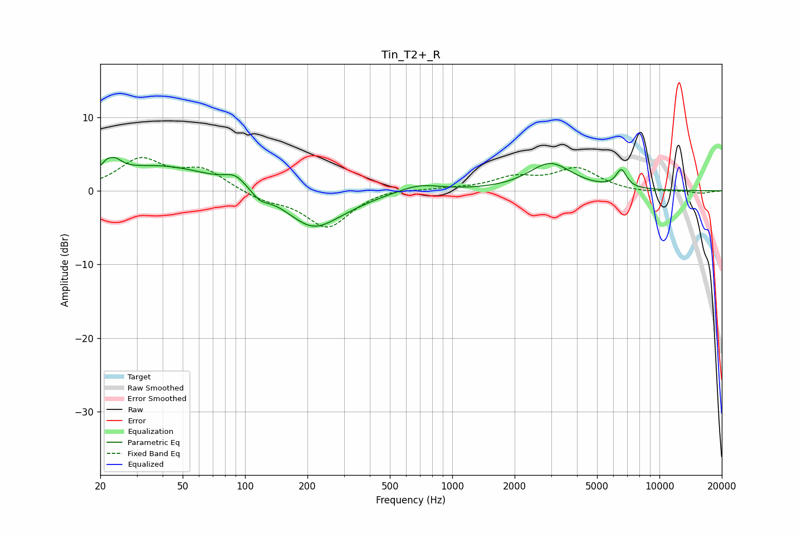

# Tin_T2+_R
See [usage instructions](https://github.com/jaakkopasanen/AutoEq#usage) for more options and info.

### Parametric EQs
Apply preamp of -4.6 dB when using parametric equalizer.

|   # | Type    |   Fc (Hz) |    Q |   Gain (dB) |
|-----|---------|-----------|------|-------------|
|   1 | Peaking |        23 | 4.29 |         4.3 |
|   2 | Peaking |        23 | 6    |        -2.2 |
|   3 | Peaking |        39 | 0.56 |         3.4 |
|   4 | Peaking |        90 | 2.66 |         1.5 |
|   5 | Peaking |       118 | 3.4  |        -1.1 |
|   6 | Peaking |       212 | 1.14 |        -4.8 |
|   7 | Peaking |       317 | 1.09 |        -0.7 |
|   8 | Peaking |       693 | 1.43 |         1.1 |
|   9 | Peaking |      2971 | 1.36 |         3.7 |
|  10 | Peaking |      6552 | 5.32 |         2.4 |

### Fixed Band EQs
When using fixed band (also called graphic) equalizer, apply preamp of **-4.6 dB** (if available) and set gains manually with these parameters.

|   # | Type    |   Fc (Hz) |    Q |   Gain (dB) |
|-----|---------|-----------|------|-------------|
|   1 | Peaking |        31 | 1.41 |         4.1 |
|   2 | Peaking |        62 | 1.41 |         2.7 |
|   3 | Peaking |       125 | 1.41 |        -1.1 |
|   4 | Peaking |       250 | 1.41 |        -5   |
|   5 | Peaking |       500 | 1.41 |         0.5 |
|   6 | Peaking |      1000 | 1.41 |         0.2 |
|   7 | Peaking |      2000 | 1.41 |         1.6 |
|   8 | Peaking |      4000 | 1.41 |         2.9 |
|   9 | Peaking |      8000 | 1.41 |        -0.3 |
|  10 | Peaking |     16000 | 1.41 |        -0.3 |

### Graphs

