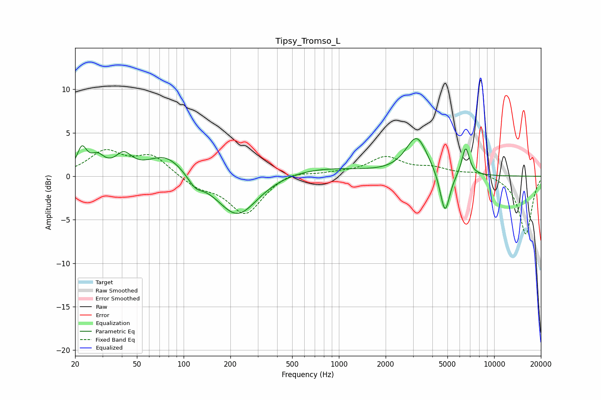

# Tipsy_Tromso_L
See [usage instructions](https://github.com/jaakkopasanen/AutoEq#usage) for more options and info.

### Parametric EQs
Apply preamp of -4.4 dB when using parametric equalizer.

|   # | Type    |   Fc (Hz) |    Q |   Gain (dB) |
|-----|---------|-----------|------|-------------|
|   1 | Peaking |        22 | 4.55 |         2.7 |
|   2 | Peaking |        28 | 3.09 |         1.7 |
|   3 | Peaking |        41 | 2.72 |         2   |
|   4 | Peaking |        77 | 1.2  |         2.5 |
|   5 | Peaking |       119 | 3.06 |        -1.1 |
|   6 | Peaking |       222 | 1.09 |        -4.8 |
|   7 | Peaking |       729 | 0.48 |         1   |
|   8 | Peaking |      3169 | 2.02 |         4.4 |
|   9 | Peaking |      4822 | 4.4  |        -5   |
|  10 | Peaking |      6553 | 5.67 |         3.3 |

### Fixed Band EQs
When using fixed band (also called graphic) equalizer, apply preamp of **-3.2 dB** (if available) and set gains manually with these parameters.

|   # | Type    |   Fc (Hz) |    Q |   Gain (dB) |
|-----|---------|-----------|------|-------------|
|   1 | Peaking |        31 | 1.41 |         2.7 |
|   2 | Peaking |        62 | 1.41 |         2.3 |
|   3 | Peaking |       125 | 1.41 |        -1.2 |
|   4 | Peaking |       250 | 1.41 |        -4.3 |
|   5 | Peaking |       500 | 1.41 |         0.7 |
|   6 | Peaking |      1000 | 1.41 |         0.3 |
|   7 | Peaking |      2000 | 1.41 |         2.1 |
|   8 | Peaking |      4000 | 1.41 |         0.8 |
|   9 | Peaking |      8000 | 1.41 |         0.6 |
|  10 | Peaking |     16000 | 1.41 |        -6.7 |

### Graphs

