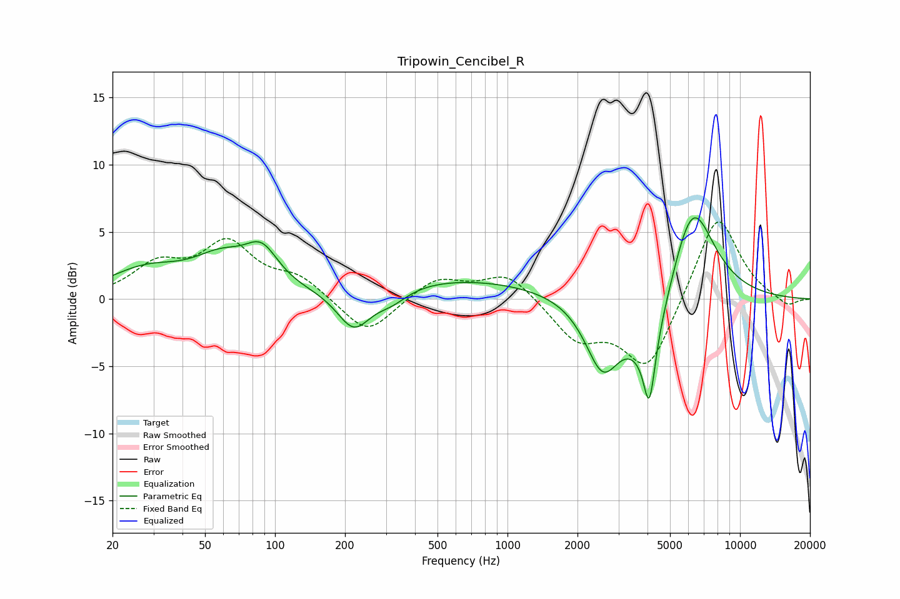

# Tripowin_Cencibel_R
See [usage instructions](https://github.com/jaakkopasanen/AutoEq#usage) for more options and info.

### Parametric EQs
Apply preamp of -6.1 dB when using parametric equalizer.

|   # | Type    |   Fc (Hz) |    Q |   Gain (dB) |
|-----|---------|-----------|------|-------------|
|   1 | Peaking |        28 | 0.88 |         2   |
|   2 | Peaking |        59 | 1.16 |         2.4 |
|   3 | Peaking |        88 | 1.97 |         2.6 |
|   4 | Peaking |       218 | 1.94 |        -3   |
|   5 | Peaking |       318 | 1.94 |        -1   |
|   6 | Peaking |       594 | 0.35 |         1.5 |
|   7 | Peaking |      2563 | 1.89 |        -5.2 |
|   8 | Peaking |      4072 | 1.54 |        -4.6 |
|   9 | Peaking |      4074 | 5.96 |        -4.6 |
|  10 | Peaking |      6226 | 1.44 |         7.7 |

### Fixed Band EQs
When using fixed band (also called graphic) equalizer, apply preamp of **-5.8 dB** (if available) and set gains manually with these parameters.

|   # | Type    |   Fc (Hz) |    Q |   Gain (dB) |
|-----|---------|-----------|------|-------------|
|   1 | Peaking |        31 | 1.41 |         2.3 |
|   2 | Peaking |        62 | 1.41 |         3.9 |
|   3 | Peaking |       125 | 1.41 |         1.5 |
|   4 | Peaking |       250 | 1.41 |        -2.8 |
|   5 | Peaking |       500 | 1.41 |         1.6 |
|   6 | Peaking |      1000 | 1.41 |         2   |
|   7 | Peaking |      2000 | 1.41 |        -2.9 |
|   8 | Peaking |      4000 | 1.41 |        -5.3 |
|   9 | Peaking |      8000 | 1.41 |         6.6 |
|  10 | Peaking |     16000 | 1.41 |        -0.7 |

### Graphs

