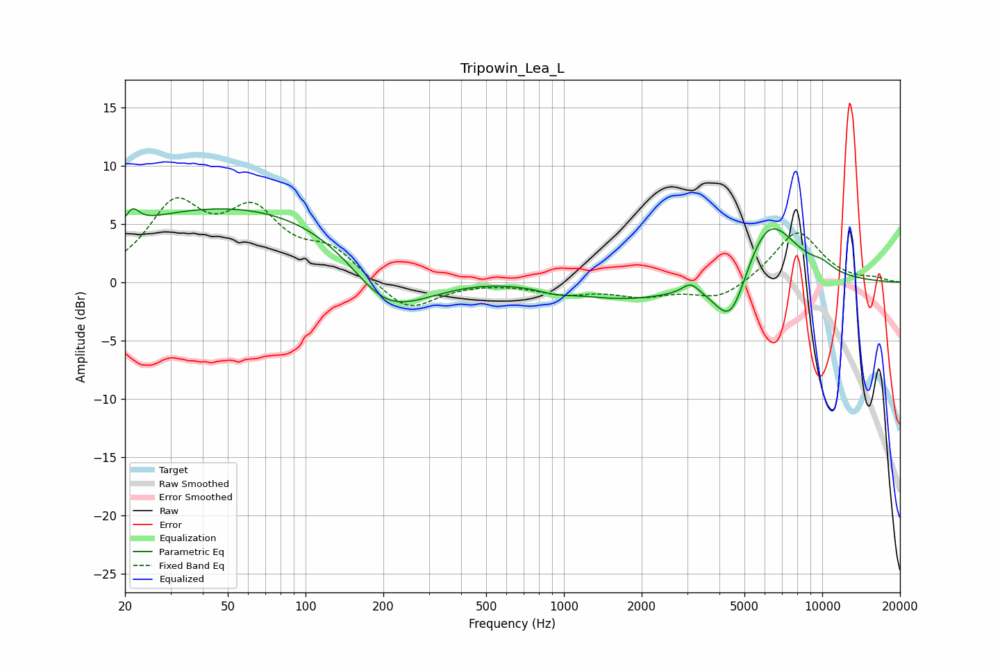

# Tripowin_Lea_L
See [usage instructions](https://github.com/jaakkopasanen/AutoEq#usage) for more options and info.

### Parametric EQs
Apply preamp of -6.4 dB when using parametric equalizer.

|   # | Type    |   Fc (Hz) |    Q |   Gain (dB) |
|-----|---------|-----------|------|-------------|
|   1 | Peaking |        21 | 5.64 |         1.3 |
|   2 | Peaking |        74 | 0.19 |         7.1 |
|   3 | Peaking |       198 | 1.12 |        -2.9 |
|   4 | Peaking |       247 | 0.64 |        -4.4 |
|   5 | Peaking |       918 | 2.49 |        -0.3 |
|   6 | Peaking |      1739 | 0.56 |        -1.6 |
|   7 | Peaking |      3097 | 4.31 |         0.9 |
|   8 | Peaking |      4432 | 2.14 |        -5   |
|   9 | Peaking |      6166 | 1.26 |         6.1 |
|  10 | Peaking |     10000 | 2.81 |         0.6 |

### Fixed Band EQs
When using fixed band (also called graphic) equalizer, apply preamp of **-7.4 dB** (if available) and set gains manually with these parameters.

|   # | Type    |   Fc (Hz) |    Q |   Gain (dB) |
|-----|---------|-----------|------|-------------|
|   1 | Peaking |        31 | 1.41 |         6.2 |
|   2 | Peaking |        62 | 1.41 |         5.3 |
|   3 | Peaking |       125 | 1.41 |         2.5 |
|   4 | Peaking |       250 | 1.41 |        -2.6 |
|   5 | Peaking |       500 | 1.41 |         0.1 |
|   6 | Peaking |      1000 | 1.41 |        -0.9 |
|   7 | Peaking |      2000 | 1.41 |        -1   |
|   8 | Peaking |      4000 | 1.41 |        -1.5 |
|   9 | Peaking |      8000 | 1.41 |         4.5 |
|  10 | Peaking |     16000 | 1.41 |         0.3 |

### Graphs

