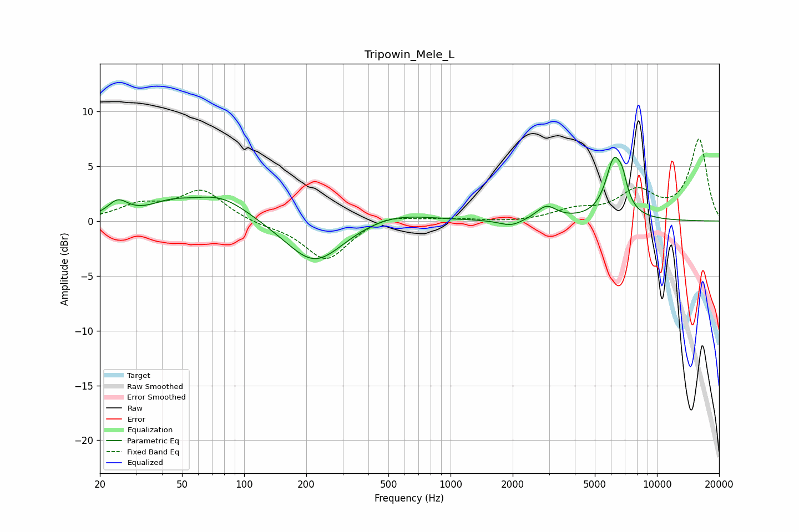

# Tripowin_Mele_L
See [usage instructions](https://github.com/jaakkopasanen/AutoEq#usage) for more options and info.

### Parametric EQs
Apply preamp of -5.9 dB when using parametric equalizer.

|   # | Type    |   Fc (Hz) |    Q |   Gain (dB) |
|-----|---------|-----------|------|-------------|
|   1 | Peaking |        24 | 2.96 |         1.4 |
|   2 | Peaking |        44 | 1.3  |         1.1 |
|   3 | Peaking |        77 | 0.98 |         2.2 |
|   4 | Peaking |       219 | 1.02 |        -4   |
|   5 | Peaking |       524 | 0.82 |         0.9 |
|   6 | Peaking |      1966 | 2.54 |        -0.6 |
|   7 | Peaking |      2915 | 2.91 |         1.3 |
|   8 | Peaking |      6216 | 3.35 |         5.6 |
|   9 | Peaking |      6526 | 4.68 |        -0.6 |
|  10 | Peaking |      6801 | 5.92 |         1.7 |

### Fixed Band EQs
When using fixed band (also called graphic) equalizer, apply preamp of **-7.6 dB** (if available) and set gains manually with these parameters.

|   # | Type    |   Fc (Hz) |    Q |   Gain (dB) |
|-----|---------|-----------|------|-------------|
|   1 | Peaking |        31 | 1.41 |         1.3 |
|   2 | Peaking |        62 | 1.41 |         2.7 |
|   3 | Peaking |       125 | 1.41 |        -0.3 |
|   4 | Peaking |       250 | 1.41 |        -3.6 |
|   5 | Peaking |       500 | 1.41 |         0.7 |
|   6 | Peaking |      1000 | 1.41 |         0.2 |
|   7 | Peaking |      2000 | 1.41 |        -0.1 |
|   8 | Peaking |      4000 | 1.41 |         0.9 |
|   9 | Peaking |      8000 | 1.41 |         2.5 |
|  10 | Peaking |     16000 | 1.41 |         7.4 |

### Graphs

