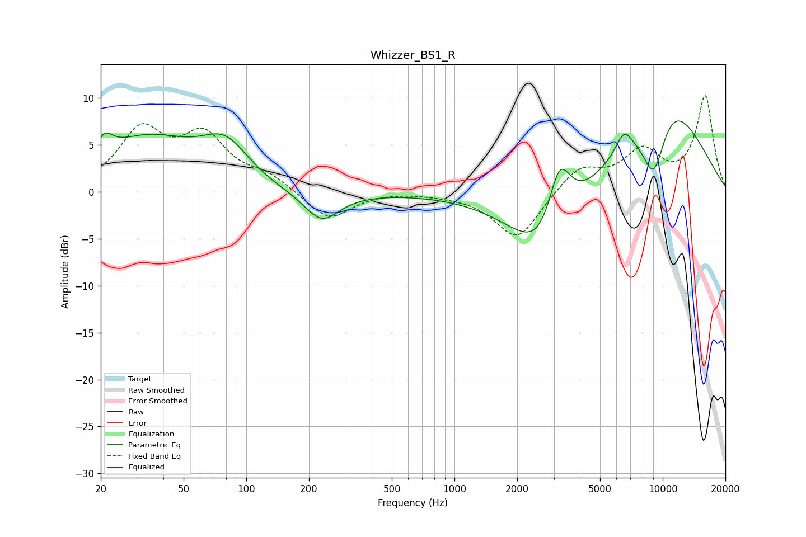

# Whizzer_BS1_R
See [usage instructions](https://github.com/jaakkopasanen/AutoEq#usage) for more options and info.

### Parametric EQs
Apply preamp of -7.7 dB when using parametric equalizer.

|   # | Type    |   Fc (Hz) |    Q |   Gain (dB) |
|-----|---------|-----------|------|-------------|
|   1 | Peaking |        21 | 3.53 |         2.1 |
|   2 | Peaking |        33 | 0.55 |         6.8 |
|   3 | Peaking |        35 | 0.2  |        -1.5 |
|   4 | Peaking |        79 | 1.2  |         4.3 |
|   5 | Peaking |       230 | 1.69 |        -3.1 |
|   6 | Peaking |      2763 | 0.91 |        -9.1 |
|   7 | Peaking |      3187 | 2.29 |         8.3 |
|   8 | Peaking |      6516 | 3.54 |         2.2 |
|   9 | Peaking |      9062 | 2.04 |        -7.8 |
|  10 | Peaking |     10000 | 0.58 |        11.1 |

### Fixed Band EQs
When using fixed band (also called graphic) equalizer, apply preamp of **-10.3 dB** (if available) and set gains manually with these parameters.

|   # | Type    |   Fc (Hz) |    Q |   Gain (dB) |
|-----|---------|-----------|------|-------------|
|   1 | Peaking |        31 | 1.41 |         6.2 |
|   2 | Peaking |        62 | 1.41 |         5.4 |
|   3 | Peaking |       125 | 1.41 |         1.5 |
|   4 | Peaking |       250 | 1.41 |        -3.1 |
|   5 | Peaking |       500 | 1.41 |         0.1 |
|   6 | Peaking |      1000 | 1.41 |        -0.2 |
|   7 | Peaking |      2000 | 1.41 |        -5.1 |
|   8 | Peaking |      4000 | 1.41 |         2.6 |
|   9 | Peaking |      8000 | 1.41 |         4   |
|  10 | Peaking |     16000 | 1.41 |        10.1 |

### Graphs

