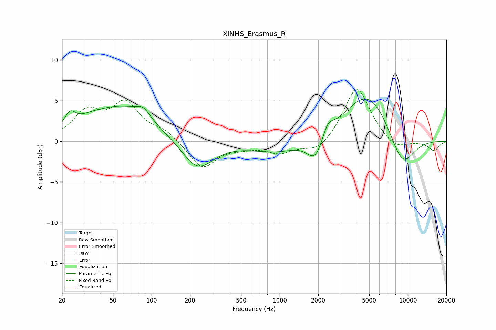

# XINHS_Erasmus_R
See [usage instructions](https://github.com/jaakkopasanen/AutoEq#usage) for more options and info.

### Parametric EQs
Apply preamp of -5.3 dB when using parametric equalizer.

|   # | Type    |   Fc (Hz) |    Q |   Gain (dB) |
|-----|---------|-----------|------|-------------|
|   1 | Peaking |        23 | 3.23 |         1.8 |
|   2 | Peaking |        33 | 1.29 |         0.8 |
|   3 | Peaking |        60 | 0.61 |         4.1 |
|   4 | Peaking |        86 | 2.68 |         1.1 |
|   5 | Peaking |       228 | 1.16 |        -3.7 |
|   6 | Peaking |       956 | 0.72 |        -1.4 |
|   7 | Peaking |      1898 | 2.19 |        -3   |
|   8 | Peaking |      2376 | 3.47 |         1.6 |
|   9 | Peaking |      4913 | 0.73 |         6.3 |
|  10 | Peaking |      8970 | 1.23 |        -4.8 |

### Fixed Band EQs
When using fixed band (also called graphic) equalizer, apply preamp of **-6.4 dB** (if available) and set gains manually with these parameters.

|   # | Type    |   Fc (Hz) |    Q |   Gain (dB) |
|-----|---------|-----------|------|-------------|
|   1 | Peaking |        31 | 1.41 |         3.3 |
|   2 | Peaking |        62 | 1.41 |         4.4 |
|   3 | Peaking |       125 | 1.41 |         1.2 |
|   4 | Peaking |       250 | 1.41 |        -3.4 |
|   5 | Peaking |       500 | 1.41 |        -0.5 |
|   6 | Peaking |      1000 | 1.41 |        -1.3 |
|   7 | Peaking |      2000 | 1.41 |        -1.5 |
|   8 | Peaking |      4000 | 1.41 |         6.8 |
|   9 | Peaking |      8000 | 1.41 |        -1.2 |
|  10 | Peaking |     16000 | 1.41 |        -1.1 |

### Graphs

